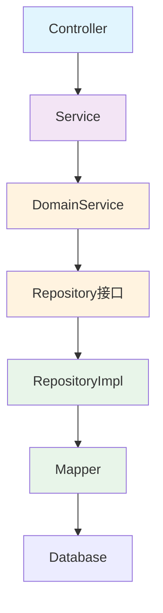

# 四层架构规则

## 核心原则

依赖倒置：接口在上层定义，实现在下层实现

## 架构层次

### 1. 接口层（Controller）

职责：
- HTTP入口，参数校验
- 调用应用服务
- 返回统一响应格式

不允许：
- 包含业务逻辑
- 直接访问数据库

### 2. 应用层（Service）

职责：
- 业务编排，调用多个领域服务
- DTO与领域对象的转换
- 定义事务边界

不允许：
- 直接访问数据库（通过Repository）

### 3. 领域层（DomainService）

职责：
- 核心业务规则
- Repository接口定义
- Gateway接口定义（外部端口）

不允许：
- 依赖任何基础设施

### 4. 基础设施层（Infrastructure）

职责：
- 实现领域层的接口
- Entity与领域对象的转换
- 外部系统调用

包含：
- Mapper、Entity
- RepositoryImpl
- GatewayImpl

## 依赖方向

## 详细规则引用

- 包结构规则：查看 `03-package-structure.md`
- 各层职责规则：查看 `04-layer-responsibility.md`
- 依赖倒置规则：查看 `05-dependency-inversion.md`