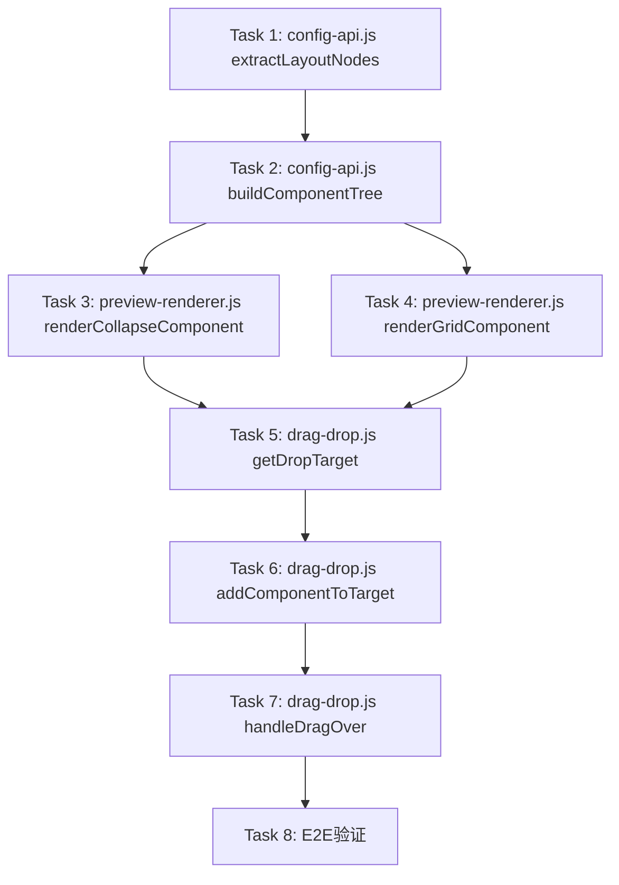

# COLLAPSE和GRID组件修复 - 交接文档

**日期**: 2026-06-08  
**设计文档**: `docs/superpowers/specs/2026-06-08-collapse-grid-fix-design.md`  
**状态**: 设计已完成，实施待执行

---

## 1. 背景和决策过程

### 问题报告

用户报告了3个问题：
1. **问题1**: COLLAPSE（折叠面板）组件预览不出来
2. **问题2**: GRID（栅格布局）组件子组件无法正确定位
3. **问题3**: 字段映射界面缺失（用户决定推迟，不在本次范围）

用户决策：先保证现有功能完整（COLLAPSE和GRID），映射功能后续再做。

### 根因分析

经过 brainstorming 分析，发现问题根源：

| 问题 | 根因 |
|-----|------|
| **COLLAPSE预览不出来** | 1. `extractLayoutNodes` 不保存 `panels` 配置<br>2. `buildComponentTree` 只映射基础属性<br>3. `renderCollapseComponent` 无点击交互<br>4. 无法拖拽子组件到面板内 |
| **GRID子组件定位失败** | 1. 子组件无 `gridColumn` 属性<br>2. 使用 innerHTML 破坏事件绑定<br>3. 无网格单元格定位逻辑 |

### 关键决策：方案B（纯树形结构）

**决策过程**：
- 我提出两个方案（A: propsJson嵌套完整对象，B: propsJson只存ID引用）
- 用户查阅 req.md 后确认：**方案B 是设计意图**
- req.md 第28行："布局节点树化：通过parent_id构建树形结构"
- req.md 第1101-1131行：DDL 定义 `parent_id` 字段用于构建树

**方案B 核心原则**：
1. 每个组件一条记录，通过 `parent_id` 关联父节点
2. `propsJson` 只存扩展属性（panels名称、gridColumn等），不存嵌套对象
3. `panels[i].children` 和 `tabs[i].children` 只存ID引用：`["comp_123"]`
4. 后端API通过 `parent_id` 组装树形 `children` 数组返回

**优势**：
- 无数据冗余（每个组件唯一记录）
- 符合数据库设计规范（外键关系）
- openGauss JSONB查询高效（GIN索引命中）
- 后端零改动（Entity.propsJson 已是 String 字段）

### 后端兼容性验证

用户特别关注后端逻辑，我验证了：

**结论**: 后端完全兼容，无需改动 ✅

| 层级 | 字段 | 兼容性 |
|-----|------|--------|
| Entity | `String propsJson` | 可存任意JSON |
| Domain | `String propsJson` | 同上 |
| Service | `node.setPropsJson(dto.getPropsJson())` | 直接保存，不解析 |

关键代码（LayoutNodeService.java:55-57）：
```java
if (dto.getPropsJson() != null) {
    node.setPropsJson(dto.getPropsJson());
}
```

前端传什么，后端存什么到JSONB字段。

### E2E验证设计

用户强调：E2E验证必须包含：
1. 数据库持久化证明（SQL查询 propsJson）
2. openGauss JSONB 特性展示（GIN索引命中，`@>` 查询）

我设计了完整的 E2E 流程：
- Chrome DevTools 操作脚本（拖拽、保存、刷新）
- SQL 数据库验证脚本
- JSONB 特性验证（EXPLAIN ANALYZE）

---

## 2. 完整改动内容

### 文件改动清单

| 文件 | 改动内容 | 代码行 |
|-----|---------|-------|
| `config-api.js` | extractLayoutNodes 增加 panels/tabs/gridColumn 保存 | 60-96 |
| `config-api.js` | buildComponentTree 合并 ID 引用和树形 children | 219-243 |
| `preview-renderer.js` | renderCollapseComponent 独立模式 + 点击交互 | 280-330 |
| `preview-renderer.js` | renderGridComponent DOM 操作 + 网格单元格 | 175-220 |
| `drag-drop.js` | getDropTarget 识别 grid-cell 和 collapse-panel | 121-145 |
| `drag-drop.js` | addComponentToTarget 处理 GRID/COLLAPSE 拖拽 | 150-164 |
| `drag-drop.js` | handleDragOver 网格单元格高亮 | 49-63 |

---

### 2.1 config-api.js - extractLayoutNodes（第60-96行）

**文件路径**: `src/main/resources/static/config/js/config-api.js`

**当前代码问题**：
只保存 span/offset/gutter/columns，遗漏了 panels/tabs/gridColumn。

**修复代码**：

```javascript
// 第72-76行，当前代码：
const propsObj = {};
if (component.span !== undefined) propsObj.span = component.span;
if (component.offset !== undefined) propsObj.offset = component.offset;
if (component.gutter !== undefined) propsObj.gutter = component.gutter;
if (component.columns !== undefined && component.columns !== null) propsObj.columns = component.columns;

// 替换为：
const propsObj = {};
// 基础布局属性
if (component.span !== undefined) propsObj.span = component.span;
if (component.offset !== undefined) propsObj.offset = component.offset;
if (component.gutter !== undefined) propsObj.gutter = component.gutter;

// 容器组件的特殊配置（方案B：ID引用）
if (component.panels !== undefined) propsObj.panels = component.panels;
if (component.tabs !== undefined) propsObj.tabs = component.tabs;

// GRID布局属性
if (component.type === 'GRID' && component.columns !== undefined) {
    propsObj.columns = component.columns;
}

// GRID子组件位置
if (component.gridColumn !== undefined) propsObj.gridColumn = component.gridColumn;
if (component.gridRow !== undefined) propsObj.gridRow = component.gridRow;

// DETAIL_TABLE列定义
if (component.type === 'DETAIL_TABLE' && component.columns !== undefined) {
    propsObj.columns = component.columns;
}
```

**关键点**：
- `panels[i].children` 只存ID字符串数组：`["comp_123"]`
- `gridColumn` 记录GRID子组件的位置（第N列）

---

### 2.2 config-api.js - buildComponentTree（第219-243行）

**文件路径**: `src/main/resources/static/config/js/config-api.js`

**当前代码问题**：
parsePropsJson 正确解析 propsJson，但需要合并 ID 引用和 API 返回的树形 children。

**修复代码**：

找到 buildComponentTree 函数，整体替换为：

```javascript
function buildComponentTree(schemaData) {
    const layoutNodes = schemaData.layoutNodes || [];
    
    if (layoutNodes.length === 0) return null;
    
    // 1. 构建组件Map（用于ID查找）
    const componentMap = {};
    
    function convertNode(node) {
        let props = parsePropsJson(node.propsJson);
        
        const component = {
            id: String(node.id),
            type: node.nodeType,
            name: node.nodeName,
            code: node.nodeCode,
            parentId: node.parentId,
            ...props,  // 展开props属性（panels/tabs/gridColumn等）
            // API返回的children是对象数组（后端通过parent_id组装）
            children: (node.children || []).map(c => convertNode(c))
        };
        
        componentMap[String(node.id)] = component;
        return component;
    }
    
    // 先遍历所有节点构建Map
    layoutNodes.forEach(node => convertNode(node));
    
    // 2. 合并ID引用和树形children（方案B关键）
    Object.values(componentMap).forEach(component => {
        // 处理panels中的ID引用
        if (component.panels) {
            component.panels.forEach(panel => {
                if (panel.children && typeof panel.children[0] === 'string') {
                    // ID引用 → 从componentMap查找完整对象
                    panel.children = panel.children.map(id => componentMap[id]);
                }
            });
        }
        
        // 处理tabs中的ID引用
        if (component.tabs) {
            component.tabs.forEach(tab => {
                if (tab.children && typeof tab.children[0] === 'string') {
                    tab.children = tab.children.map(id => componentMap[id]);
                }
            });
        }
    });
    
    // 返回根节点
    return layoutNodes[0] ? componentMap[String(layoutNodes[0].id)] : null;
}
```

**关键点**：
- 构建 `componentMap` 供 ID 快速查找
- 检查 `panel.children[0]` 是否为字符串（ID）
- 如果是 ID，从 Map 查找完整对象替换
- 保留 API 返回的树形 `children` 数组（后端通过 parent_id 组装）

---

### 2.3 preview-renderer.js - renderCollapseComponent（第280-330行）

**文件路径**: `src/main/resources/static/config/js/preview-renderer.js`

**当前代码问题**：
- 无点击交互，静态展示
- 只渲染第一个面板的内容
- 无展开/折叠动画

**修复代码**：

找到 renderCollapseComponent 函数（第280-330行），整体替换为：

```javascript
function renderCollapseComponent(component) {
    const element = document.createElement('div');
    element.className = 'component-preview';
    element.dataset.componentId = component.id;
    element.style.cssText = `
        background: #f6f8fa;
        padding: 10px;
        margin-bottom: 10px;
    `;

    // 渲染标签
    let collapseHTML = `
        <div class="component-preview-label" style="margin-bottom: 10px;">
            <i class="fas fa-chevron-down"></i> ${component.name}
        </div>
    `;

    // 渲染面板结构（独立模式：默认全部展开）
    if (component.panels && component.panels.length > 0) {
        component.panels.forEach((panel, index) => {
            const isExpanded = panel.expanded !== false;  // 默认展开
            
            collapseHTML += `
                <div class="collapse-panel" data-panel-index="${index}" style="
                    border: 1px solid #e1e4e8;
                    margin-bottom: -1px;
                ">
                    <div class="panel-header" style="
                        padding: 10px 15px;
                        background: #f6f8fa;
                        cursor: pointer;
                        display: flex;
                        align-items: center;
                        gap: 8px;
                    ">
                        <i class="fas fa-chevron-${isExpanded ? 'down' : 'right'}"></i>
                        <span>${panel.name}</span>
                    </div>
                    <div class="panel-content" style="
                        padding: 15px;
                        display: ${isExpanded ? 'block' : 'none'};
                        transition: all 0.3s ease;
                    "></div>
                </div>
            `;
        });
    }

    element.innerHTML = collapseHTML;

    // 渲染每个面板的子组件
    if (component.panels && component.panels.length > 0) {
        component.panels.forEach((panel, index) => {
            if (panel.children && panel.children.length > 0) {
                const contentContainer = element.querySelectorAll('.panel-content')[index];
                panel.children.forEach(child => {
                    // child可能是ID字符串或完整对象
                    const childComponent = typeof child === 'string' 
                        ? findComponentById(child) 
                        : child;
                    if (childComponent) {
                        const childElement = renderComponent(childComponent);
                        if (childElement) {
                            contentContainer.appendChild(childElement);
                        }
                    }
                });
            }
        });
    }

    // 绑定点击事件（独立模式：每个面板单独控制）
    element.querySelectorAll('.panel-header').forEach(header => {
        header.addEventListener('click', (e) => {
            e.stopPropagation();
            const panel = header.parentElement;
            const content = panel.querySelector('.panel-content');
            const icon = header.querySelector('i');
            
            const isExpanded = content.style.display !== 'none';
            content.style.display = isExpanded ? 'none' : 'block';
            icon.className = `fas fa-chevron-${isExpanded ? 'right' : 'down'}`;
        });
    });

    // 绑定组件选中事件
    element.addEventListener('click', (e) => {
        e.stopPropagation();
        selectComponent(component.id);
    });

    return element;
}
```

**关键点**：
- **独立模式**: 每个面板单独控制，可同时展开多个
- **默认展开**: `isExpanded = panel.expanded !== false`
- **点击交互**: 绑定 `panel-header` 的 click 事件
- **子组件渲染**: 支持所有面板，不只是第一个
- **ID兼容**: `typeof child === 'string'` 判断，支持 ID 引用或完整对象

---

### 2.4 preview-renderer.js - renderGridComponent（第175-220行）

**文件路径**: `src/main/resources/static/config/js/preview-renderer.js`

**当前代码问题**：
- 使用 `innerHTML` + `renderComponentPreview`，破坏子组件事件绑定
- 无网格单元格概念，子组件随机分配

**修复代码**：

找到 renderGridComponent 函数（第175-220行），整体替换为：

```javascript
function renderGridComponent(component) {
    const element = document.createElement('div');
    element.className = 'component-preview';
    element.dataset.componentId = component.id;
    element.style.cssText = `
        background: #f6f8fa;
        padding: 10px;
        margin-bottom: 10px;
    `;

    const columns = component.columns || 2;
    const gutter = component.gutter || 16;

    // 渲染标签
    const labelDiv = document.createElement('div');
    labelDiv.className = 'component-preview-label';
    labelDiv.style.marginBottom = '10px';
    labelDiv.innerHTML = `<i class="fas fa-th"></i> ${component.name} (${columns}列)`;
    element.appendChild(labelDiv);

    // 创建网格容器（使用CSS Grid）
    const gridContainer = document.createElement('div');
    gridContainer.style.cssText = `
        display: grid;
        grid-template-columns: repeat(${columns}, 1fr);
        gap: ${gutter}px;
    `;

    // 创建网格单元格（每列一个）
    for (let i = 0; i < columns; i++) {
        const cell = document.createElement('div');
        cell.className = 'grid-cell';
        cell.dataset.gridColumn = i;
        cell.style.cssText = `
            min-height: 80px;
            border: 1px dashed #d1d5da;
            background: white;
            padding: 10px;
        `;
        
        // 渲染该列的子组件（根据 gridColumn 属性筛选）
        const columnChildren = component.children?.filter(c => c.gridColumn === i) || [];
        if (columnChildren.length > 0) {
            columnChildren.forEach(child => {
                const childElement = renderComponent(child);
                if (childElement) {
                    cell.appendChild(childElement);
                }
            });
        } else {
            // 空列提示
            cell.innerHTML = `<div style="padding:20px;text-align:center;color:#b4b4b4;">
                拖拽组件到第${i+1}列
            </div>`;
        }
        
        gridContainer.appendChild(cell);
    }

    element.appendChild(gridContainer);

    // 绑定组件选中事件
    element.addEventListener('click', (e) => {
        e.stopPropagation();
        selectComponent(component.id);
    });

    return element;
}
```

**关键点**：
- **DOM操作**: createElement + appendChild，保留子组件事件绑定
- **网格单元格**: 每列创建 `div.grid-cell`，带 `dataset.gridColumn` 属性
- **子组件按列分配**: 根据 `child.gridColumn === i` 筛选
- **空列提示**: 显示"拖拽组件到第N列"

---

### 2.5 drag-drop.js - getDropTarget（第121-145行）

**文件路径**: `src/main/resources/static/config/js/drag-drop.js`

**当前代码问题**：
只识别普通容器，无法识别 grid-cell 和 collapse-panel。

**修复代码**：

找到 getDropTarget 函数，整体替换为：

```javascript
function getDropTarget(event) {
    const elements = document.elementsFromPoint(event.clientX, event.clientY);

    for (const element of elements) {
        // 优先级1：grid-cell（GRID的网格单元格）
        const gridCell = element.closest('.grid-cell');
        if (gridCell) {
            const gridColumn = gridCell.dataset.gridColumn;
            const gridContainer = gridCell.closest('.component-preview');
            
            if (gridContainer) {
                const gridId = gridContainer.dataset.componentId;
                const gridComponent = findComponentById(gridId);
                
                return {
                    type: 'grid-cell',
                    component: gridComponent,
                    gridColumn: parseInt(gridColumn),
                    element: gridCell
                };
            }
        }

        // 优先级2：collapse-panel（COLLAPSE的面板）
        const collapsePanel = element.closest('.collapse-panel');
        if (collapsePanel) {
            const panelIndex = collapsePanel.dataset.panelIndex;
            const collapseContainer = collapsePanel.closest('.component-preview');
            
            if (collapseContainer) {
                const collapseId = collapseContainer.dataset.componentId;
                const collapseComponent = findComponentById(collapseId);
                
                return {
                    type: 'collapse-panel',
                    component: collapseComponent,
                    panelIndex: parseInt(panelIndex),
                    element: collapsePanel
                };
            }
        }

        // 优先级3：tab-panel（TAB的页签）
        const tabPanel = element.closest('.tab-content');
        if (tabPanel) {
            const tabContainer = tabPanel.closest('.component-preview');
            
            if (tabContainer) {
                const tabId = tabContainer.dataset.componentId;
                const tabComponent = findComponentById(tabId);
                
                // 找到当前激活的tab索引
                const activeTab = tabContainer.querySelector('.tab-item.active');
                const tabIndex = activeTab ? parseInt(activeTab.dataset.tabIndex || 0) : 0;
                
                return {
                    type: 'tab-panel',
                    component: tabComponent,
                    tabIndex: tabIndex,
                    element: tabPanel
                };
            }
        }

        // 优先级4：普通容器
        const componentPreview = element.closest('.component-preview');
        if (componentPreview) {
            const componentId = componentPreview.dataset.componentId;
            const component = findComponentById(componentId);

            if (component?.isContainer || component?.children) {
                return { type: 'append', component: component };
            }
        }
    }

    return null;
}
```

**关键点**：
- **优先级顺序**: grid-cell > collapse-panel > tab-panel > 普通容器
- **dataset 属性**: 使用 `dataset.gridColumn` 和 `dataset.panelIndex`
- **closest 查找**: 使用 `element.closest()` 查找最近的父元素

---

### 2.6 drag-drop.js - addComponentToTarget（第150-164行）

**文件路径**: `src/main/resources/static/config/js/drag-drop.js`

**当前代码问题**：
只处理普通容器拖拽，无法处理 GRID 和 COLLAPSE 的特殊拖拽。

**修复代码**：

找到 addComponentToTarget 函数，整体替换为：

```javascript
function addComponentToTarget(component, target) {
    if (target.type === 'grid-cell') {
        // GRID网格列拖拽（方案B：存gridColumn + parent_id）
        component.gridColumn = target.gridColumn;
        component.gridRow = 0;
        component.parentId = target.component.id;  // ← 设置parent_id
        
        // 加入target.component.children（用于renderPreview）
        if (!target.component.children) {
            target.component.children = [];
        }
        target.component.children.push(component);
        
        renderPreview();
        selectComponent(component.id);
        saveState();
        
    } else if (target.type === 'collapse-panel') {
        // COLLAPSE面板拖拽（方案B：存ID引用 + parent_id）
        if (!target.component.panels[target.panelIndex].children) {
            target.component.panels[target.panelIndex].children = [];
        }
        // 只存ID引用（用于保存到propsJson）
        target.component.panels[target.panelIndex].children.push(component.id);
        
        component.parentId = target.component.id;  // ← 设置parent_id
        
        // 同时加入target.component.children（用于renderPreview）
        if (!target.component.children) {
            target.component.children = [];
        }
        target.component.children.push(component);
        
        renderPreview();
        selectComponent(component.id);
        saveState();
        
    } else if (target.type === 'tab-panel') {
        // TAB页签拖拽（方案B：存ID引用 + parent_id）
        if (!target.component.tabs[target.tabIndex].children) {
            target.component.tabs[target.tabIndex].children = [];
        }
        target.component.tabs[target.tabIndex].children.push(component.id);  // ← 只存ID
        
        component.parentId = target.component.id;
        
        if (!target.component.children) {
            target.component.children = [];
        }
        target.component.children.push(component);
        
        renderPreview();
        selectComponent(component.id);
        saveState();
        
    } else if (target.type === 'append') {
        // 普通容器拖拽
        component.parentId = target.component.id;
        
        if (!target.component.children) {
            target.component.children = [];
        }
        target.component.children.push(component);
        
        renderPreview();
        selectComponent(component.id);
        saveState();
    }
}
```

**关键点**（方案B核心）：
- **GRID**: `component.gridColumn = target.gridColumn` + `component.parentId = target.component.id`
- **COLLAPSE**: `panels[i].children.push(component.id)` + `component.parentId`
- **TAB**: `tabs[i].children.push(component.id)` + `component.parentId`
- **双数组维护**: propsJson 存 ID（用于保存），children 存完整对象（用于渲染）

---

### 2.7 drag-drop.js - handleDragOver（第49-63行）

**文件路径**: `src/main/resources/static/config/js/drag-drop.js`

**新增视觉反馈**：

找到 handleDragOver 函数，在原有代码基础上添加：

```javascript
function handleDragOver(event) {
    event.preventDefault();
    
    // 清除之前的高亮
    document.querySelectorAll('.grid-cell-drop-target').forEach(el => {
        el.classList.remove('grid-cell-drop-target');
        el.style.background = '';
        el.style.border = '';
    });
    
    // 检查当前悬停的grid-cell
    const dropTarget = getDropTarget(event);
    if (dropTarget?.type === 'grid-cell') {
        dropTarget.element.classList.add('grid-cell-drop-target');
        dropTarget.element.style.background = 'rgba(102,126,234,0.1)';
        dropTarget.element.style.border = '2px dashed #667eea';
    }
    
    // ...原有代码...
}
```

---

## 3. 实施顺序和依赖关系

### 实施顺序（按前端逻辑分层）



### 依赖关系说明

| Task | 依赖 | 原因 |
|-----|------|------|
| Task 1 | 无 | 保存逻辑独立，不依赖其他改动 |
| Task 2 | Task 1 | 加载需要读取 Task 1 保存的数据结构 |
| Task 3 | Task 2 | 渲染需要 Task 2 加载的完整组件树 |
| Task 4 | Task 2 | 同上 |
| Task 5 | Task 3, Task 4 | 拖拽定位依赖渲染后的 DOM 元素（grid-cell, collapse-panel） |
| Task 6 | Task 5 | 组件添加依赖 Task 5 的 dropTarget 识别 |
| Task 7 | Task 5 | 拖拽反馈依赖 dropTarget |
| Task 8 | 所有前置 | E2E 验证完整闭环 |

### 推荐实施方式

**批次执行**（减少上下文切换）：

| 批次 | Tasks | 文件 | 验证点 |
|-----|-------|------|--------|
| **Batch 1** | Task 1-2 | config-api.js | 保存/加载逻辑完成，单元测试验证 propsJson 结构 |
| **Batch 2** | Task 3-4 | preview-renderer.js | 渲染逻辑完成，手动验证 COLLAPSE/GRID 显示正确 |
| **Batch 3** | Task 5-7 | drag-drop.js | 拖拽逻辑完成，手动验证拖拽定位正确 |
| **Batch 4** | Task 8 | E2E | Chrome DevTools + SQL 完整验证 |

---

## 4. 验证方法

### 4.1 单元验证（每个 Task 完成后）

| Task | 验证方法 |
|-----|---------|
| Task 1 | 手动保存，console.log 打印 layoutNodes，检查 propsJson 包含 panels/gridColumn |
| Task 2 | 手动加载，console.log 打印 componentTree，检查 panels[i].children 是完整对象 |
| Task 3 | 手动添加 COLLAPSE，检查：1. 面板渲染，2. 点击展开/折叠有动画 |
| Task 4 | 手动添加 GRID，检查：1. 网格单元格显示，2. 空列提示 |
| Task 5 | 手动拖拽，hover 到 grid-cell，检查 console.log 打印 dropTarget |
| Task 6 | 手动拖拽 INPUT 到面板，检查 INPUT 出现在面板内 |
| Task 7 | 手动拖拽，hover 到 grid-cell，检查单元格高亮 |

### 4.2 E2E验证（完整闭环）

**验证工具**: Chrome DevTools MCP

**COLLAPSE场景验证步骤**：

1. **拖拽COLLAPSE**: 导航到设计器，拖拽 COLLAPSE 到画布
2. **拖拽INPUT到面板**: 拖拽 INPUT 到面板1内容区
3. **保存**: 点击保存按钮，等待成功提示
4. **刷新**: 刷新页面，验证 COLLAPSE 和 INPUT 都渲染
5. **交互验证**: 点击面板标题，验证展开/折叠动画
6. **网络请求验证**: 检查 API 请求体（layoutNodes 结构）
7. **数据库验证**: SQL 查询 propsJson 包含 panels，children 是 ID 引用
8. **JSONB特性验证**: EXPLAIN ANALYZE 验证 GIN 索引命中

**GRID场景验证步骤**：

1. **拖拽GRID**: 拖拽 GRID（2列）到画布
2. **拖拽INPUT到第1列**: 拖拽 INPUT 到左列（grid-cell-0）
3. **拖拽SELECT到第2列**: 拖拽 SELECT 到右列（grid-cell-1）
4. **保存**: 点击保存，验证 API 返回 200
5. **刷新**: 刷新页面，验证 INPUT 在左列，SELECT 在右列
6. **数据库验证**: SQL 查询 propsJson 包含 gridColumn=0/1
7. **JSONB验证**: EXPLAIN ANALYZE 验证 GIN 索引命中

### 4.3 SQL验证脚本

**查询COLLAPSE节点**：
```sql
SELECT 
    id,
    parent_id,
    node_type,
    props_json
FROM t_ui_layout_node
WHERE node_type = 'COLLAPSE'
AND template_version_id = {versionId};

-- 预期：props_json = '{"panels":[{"name":"面板1","children":["INPUT_ID"]}]}'
```

**查询GRID子组件**：
```sql
SELECT 
    id,
    parent_id,
    node_type,
    props_json::jsonb->>'gridColumn' as grid_column
FROM t_ui_layout_node
WHERE parent_id = {GRID_ID}
AND template_version_id = {versionId};

-- 预期：INPUT grid_column='0', SELECT grid_column='1'
```

**GIN索引命中验证**：
```sql
EXPLAIN ANALYZE
SELECT * FROM t_ui_layout_node
WHERE props_json::jsonb @> '{"gridColumn":0}'::jsonb
AND template_version_id = {versionId};

-- 预期：Bitmap Index Scan on idx_layout_props_gin
```

---

## 5. 风险点

### 5.1 方案B理解偏差

**风险**: 实施者可能误解方案B，错误实现嵌套对象存储。

**预防**: 
- 反复强调：`panels[i].children` 只存ID字符串数组
- 每个改动点都有代码注释标注"方案B：存ID引用"
- E2E验证明确检查 propsJson 结构

### 5.2 后端API树形组装

**风险**: spec 提到后端需要组装树形 children，但用户说后端零改动。

**澄清**: 
- 当前后端逻辑：查询所有节点，前端通过 parent_id 构建树
- spec 提出的改进：后端组装树返回（可选优化）
- **本次实施不改动后端**，前端通过 parent_id 构建树即可

### 5.3 ID引用查找失败

**风险**: buildComponentTree 中 `componentMap[id]` 可能返回 undefined。

**预防**: 
- 添加容错逻辑：`const child = componentMap[id]; if (child) ...`
- console.log 打印缺失的 ID，便于调试

### 5.4 拖拽定位不准确

**风险**: getDropTarget 可能无法正确识别 grid-cell。

**预防**: 
- 确保 renderGridComponent 创建的 grid-cell 有 `dataset.gridColumn` 属性
- 确保 CSS Grid 布局正确渲染，grid-cell 可被 elementsFromPoint 检测到

### 5.5 事件绑定冲突

**风险**: COLLAPSE/GRID 的子组件点击事件可能被父组件拦截。

**预防**: 
- 使用 `e.stopPropagation()` 阻止事件冒泡
- 子组件渲染使用 DOM 操作（createElement），而非 innerHTML

---

## 6. 其他

### 6.1 TAB组件遗漏修复

**现状**: spec 提到 TAB 也需要类似处理，但未详细说明。

**建议**: 
- 本次实施一并修复 TAB（代码片段中已包含）
- TAB 的逻辑与 COLLAPSE 完全一致：`tabs[i].children` 只存 ID

### 6.2 findComponentById 函数

**依赖**: drag-drop.js 中使用 `findComponentById(id)`，需确认该函数存在。

**检查**: 如果不存在，需要实现：
```javascript
function findComponentById(id) {
    return DesignerState.components.find(c => c.id === id);
}
```

### 6.3 DesignerState 全局状态

**依赖**: 代码中使用 `DesignerState.components`，需确认该全局对象存在。

**检查**: 查看 designer.js 或 config-api.js，确认 DesignerState 已定义。

### 6.4 openGauss JSONB 索引

**依赖**: E2E验证需要 idx_layout_props_gin 索引。

**检查**: 确认数据库已有该索引：
```sql
SELECT indexname FROM pg_indexes 
WHERE tablename = 't_ui_layout_node' 
AND indexname = 'idx_layout_props_gin';
```

如果没有，需要创建：
```sql
CREATE INDEX idx_layout_props_gin 
ON t_ui_layout_node USING GIN (props_json::jsonb);
```

### 6.5 代码风格一致性

**建议**: 
- 遵循现有代码风格（变量命名、注释风格）
- 使用 ES6 语法（箭头函数、const/let）
- 不引入新的外部依赖

---

## 7. 新会话启动提示

**请在新会话启动时发送以下内容**：

---

```
我需要继续实施 COLLAPSE和GRID组件修复。

设计文档：docs/superpowers/specs/2026-06-08-collapse-grid-fix-design.md
交接文档：docs/superpowers/handover/2026-06-08-collapse-grid-fix-handover.md

核心方案：方案B（纯树形结构）
- propsJson 只存 ID 引用：panels[i].children = ["comp_123"]
- 通过 parent_id 构建树形结构
- 后端零改动

改动文件：
1. config-api.js (extractLayoutNodes + buildComponentTree)
2. preview-renderer.js (renderCollapseComponent + renderGridComponent)
3. drag-drop.js (getDropTarget + addComponentToTarget + handleDragOver)

实施顺序：按 Batch 分批执行（见交接文档第3节）
E2E验证：Chrome DevTools + SQL + JSONB（见交接文档第4节）

请阅读交接文档后，按 Batch 顺序开始实施。
```

---

**交接文档完成。新会话可直接使用上述启动提示。**