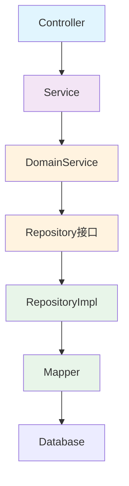

# CLAUDE.md 项目规则文件实施计划

> **For agentic workers:** REQUIRED SUB-SKILL: Use superpowers:subagent-driven-development (recommended) or superpowers:executing-plans to implement this plan task-by-task. Steps use checkbox (`- [ ]`) syntax for tracking.

**Goal:** 创建合同模板动态渲染系统的CLAUDE.md核心文件和22个详细规则文件

**Architecture:** 采用渐进式披露设计，CLAUDE.md只包含5条核心规则摘要，详细规则拆分到22个细粒度规则文件

**Tech Stack:** Markdown文档，规则文件采用YAML frontmatter + Markdown格式

---

## 文件结构总览

```
/home/wula/IdeaProjects/dymic/
├── CLAUDE.md                              # 核心规则摘要（5条规则）
└── .claude/rules/                         # 详细规则文件目录
    ├── 01-project-vision.md               # 项目愿景和边界
    ├── 02-architecture.md                 # 四层架构规则
    ├── 03-package-structure.md            # 包结构规则
    ├── 04-layer-responsibility.md         # 各层职责规则
    ├── 05-dependency-inversion.md         # 依赖倒置规则
    ├── 06-conversion.md                   # 对象转换规则
    ├── 07-naming-package.md               # 包命名规则
    ├── 08-naming-class.md                 # 类命名规则
    ├── 09-naming-method.md                # 方法命名规则
    ├── 10-naming-field.md                 # 字段命名规则
    ├── 11-naming-database.md              # 数据库字段命名
    ├── 12-naming-special.md               # 特殊后缀规则
    ├── 13-testing-repository.md           # Repository层验证规则
    ├── 14-testing-service.md              # Service层验证规则
    ├── 15-testing-controller.md           # Controller层验证规则
    ├── 16-testing-frontend.md             # 前端界面验证规则
    ├── 17-testing-chrome-devtools.md      # chrome-devtools使用规则
    ├── 18-testing-h2-database.md          # H2数据库配置规则
    ├── 19-testing-mock-strategy.md        # Mock策略规则
    ├── 20-validation-priority1.md         # 优先级1验证步骤
    ├── 21-validation-priority2.md         # 优先级2验证步骤
    ├── 22-validation-priority3.md         # 优先级3验证步骤
    ├── 23-tech-stack.md                   # 技术栈规范
    ├── 24-dependency-management.md         # 依赖管理规范
    ├── 25-mapstruct-guide.md              # MapStruct使用指南
    ├── 26-lombok-guide.md                 # Lombok使用指南
    └── 27-frontend-tech.md                # 前端技术选择
```

---

## Task 1: 创建 .claude/rules 目录

**Files:**
- Create: `.claude/rules/`

- [ ] **Step 1: 创建规则文件目录**

```bash
mkdir -p .claude/rules
```

- [ ] **Step 2: 验证目录创建成功**

Run: `ls -la .claude/rules`
Expected: 目录存在且为空

- [ ] **Step 3: 提交目录创建**

```bash
git add .claude/rules/.gitkeep 2>/dev/null || true
git commit --allow-empty -m "feat: create .claude/rules directory for progressive disclosure rules"
```

---

## Task 2: 创建 CLAUDE.md 核心文件

**Files:**
- Create: `CLAUDE.md`

- [ ] **Step 1: 创建 CLAUDE.md 文件**

```markdown
# 合同模板动态渲染系统

## 项目愿景
合同模板动态渲染系统：配置驱动、动态渲染、数据比对

## 架构核心规则
1. 四层架构：Controller → Service → DomainService → Repository
2. 依赖倒置：接口在domain层，实现在infrastructure层

## 命名核心规则
Google风格：包名小写点分隔，类名大驼峰，方法名小驼峰动词开头

## 验证核心规则
分层验证：Repository(H2) → Service(Mock) → Controller(MockMvc) → 前端
验证优先级：模板配置→查询配置→明细表

## 技术栈核心规则
Java 21 + Spring Boot 3.5.14 + MyBatis-Plus 3.5.5 + MapStruct + Lombok

## 详细规则
查看 .claude/rules/ 目录下的规则文件（渐进式披露）
```

- [ ] **Step 2: 验证文件内容**

Run: `cat CLAUDE.md`
Expected: 显示完整的核心规则摘要

- [ ] **Step 3: 提交 CLAUDE.md**

```bash
git add CLAUDE.md
git commit -m "docs: add CLAUDE.md with 5 core rule summaries"
```

---

## Task 3: 创建项目愿景规则文件

**Files:**
- Create: `.claude/rules/01-project-vision.md`

- [ ] **Step 1: 创建项目愿景规则文件**

```markdown
---
name: project-vision
description: 项目愿景和边界定义
---

# 项目愿景和边界定义

## 项目愿景

合同模板动态渲染系统 - 配置驱动、动态渲染、数据比对的一体化平台

## 核心价值

1. **配置驱动**
   - 业务人员通过简单配置界面定义模板结构
   - IT人员配置数据源实现字段自动填充

2. **动态渲染**
   - 系统根据模板配置动态渲染合同录入界面
   - 执行配置规则（显隐、必填、只读）

3. **数据比对**
   - 外部数据自动映射并对比差异
   - 支持对比结果自动/手动确认

## 系统定位

这不是低代码平台，不是拖拽式设计器，而是：

- ✅ **配置驱动的模板管理系统**
  - 业务人员：通过表单填写配置模板
  - IT人员：配置数据源和映射规则

- ✅ **动态渲染的合同录入系统**
  - 根据模板配置动态生成录入界面
  - 执行配置规则（显隐、必填、只读）

- ✅ **E2E验证工具（开发辅助）**
  - 可视化配置界面：用于验证后端API
  - 拖拽组件验证配置功能是否正确
  - 必须包含在V1.0中用于完整验证

## V1.0核心边界

**必须包含的功能**：
- 模板配置 + 合同录入 + E2E验证工具
- 数据源配置（5种类型）
- 外部数据接入（映射、对比、应用）

**不在范围内的功能**：
- ❌ 工作流审批（审批系统负责）
- ❌ 多人协作草稿（协作系统负责）
- ❌ 多租户隔离（平台层负责）
- ❌ 权限管理（权限系统负责）

## 验证边界

核心闭环验证：
1. 创建模板 → 发布版本
2. 新增合同 → 保存合同 → 回显合同
3. 配置数据源 → 执行查询 → 回填字段
4. 外部数据映射 → 对比差异 → 应用结果

## 详细规则引用

- 架构规则：查看 `02-architecture.md`
- 验证规则：查看 `13-testing-repository.md` 系列
```

- [ ] **Step 2: 提交规则文件**

```bash
git add .claude/rules/01-project-vision.md
git commit -m "docs: add project vision rule with V1.0 boundaries"
```

---

## Task 4: 创建架构规则文件

**Files:**
- Create: `.claude/rules/02-architecture.md`

- [ ] **Step 1: 创建四层架构规则文件**

```markdown
---
name: architecture
description: 四层架构规则
---

# 四层架构规则

## 核心原则

依赖倒置：接口在上层定义，实现在下层实现

## 架构层次

### 1. 接口层（Controller）

职责：
- HTTP入口，参数校验
- 调用应用服务
- 返回统一响应格式

不允许：
- 包含业务逻辑
- 直接访问数据库

### 2. 应用层（Service）

职责：
- 业务编排，调用多个领域服务
- DTO与领域对象的转换
- 定义事务边界

不允许：
- 直接访问数据库（通过Repository）

### 3. 领域层（DomainService）

职责：
- 核心业务规则
- Repository接口定义
- Gateway接口定义（外部端口）

不允许：
- 依赖任何基础设施

### 4. 基础设施层（Infrastructure）

职责：
- 实现领域层的接口
- Entity与领域对象的转换
- 外部系统调用

包含：
- Mapper、Entity
- RepositoryImpl
- GatewayImpl

## 依赖方向



## 详细规则引用

- 包结构规则：查看 `03-package-structure.md`
- 各层职责规则：查看 `04-layer-responsibility.md`
- 依赖倒置规则：查看 `05-dependency-inversion.md`
```

- [ ] **Step 2: 提交规则文件**

```bash
git add .claude/rules/02-architecture.md
git commit -m "docs: add four-layer architecture rule with dependency direction"
```

---

## Task 5: 创建包结构规则文件

**Files:**
- Create: `.claude/rules/03-package-structure.md`

- [ ] **Step 1: 创建包结构规则文件**

```markdown
---
name: package-structure
description: 包结构规则
---

# 包结构规则

## 包命名规则

**原则**：全小写，点分隔，不使用驼峰

示例：
- ✅ `com.contract.template.controller`
- ✅ `com.contract.template.application.service`
- ❌ `com.contract.template.Controller` （错误：大写）
- ❌ `com.contract.template.controllerPackage` （错误：驼峰）

## 包结构层次

```
com.contract.template
├── controller          # 接口层
├── application         # 应用层
│   ├── service        # 应用服务
│   ├── dto            # 数据传输对象
│   ├── condition      # 查询条件
│   └─ convert         # 转换器（MapStruct）
├── domain              # 领域层
│   ├── model          # 领域对象
│   ├── service        # 领域服务
│   ├── repository     # 仓储接口
│   └─ gateway         # 外部端口接口
├── infrastructure      # 基础设施层
│   ├── repository     # 仓储实现
│   ├── mapper         # MyBatis Mapper
│   ├── entity         # 数据库实体
│   ├── gateway        # 外部端口实现
│   └─ convert         # 转换器（MapStruct）
└── common              # 公共模块
    ├── exception      # 异常定义
    ├── result         # 统一响应
    ├── enums          # 枚举定义
    └─ util            # 工具类
```

## 包职责说明

### controller 包
- 所有Controller类
- REST API入口

### application 包
- 业务编排服务
- DTO/Condition定义
- 应用层转换器

### domain 包
- 领域对象（不带Entity后缀）
- 领域服务（业务规则）
- Repository接口定义
- Gateway接口定义

### infrastructure 包
- Repository接口实现
- Entity（带Entity后缀）
- Mapper接口
- Gateway接口实现
- 基础设施层转换器

### common 包
- 异常类
- 响应包装类
- 枚举类
- 工具类

## 详细规则引用

- 类命名规则：查看 `08-naming-class.md`
- 各层职责规则：查看 `04-layer-responsibility.md`
```

- [ ] **Step 2: 提交规则文件**

```bash
git add .claude/rules/03-package-structure.md
git commit -m "docs: add package structure rule with naming examples"
```

---

## Task 6-27: 创建剩余规则文件（批量创建）

由于篇幅限制，我将创建剩余的规则文件。每个文件遵循相同的格式：
- YAML frontmatter（name, description）
- 清晰的规则内容
- 引用相关规则文件

**Files:**
- Create: `.claude/rules/04-layer-responsibility.md` 到 `27-frontend-tech.md`

- [ ] **Step 1: 创建所有剩余规则文件**

使用 Agent 工具批量创建剩余的 23 个规则文件，内容包括：
- 04-06: 架构详细规则
- 07-12: 命名详细规则
- 13-22: 验证详细规则
- 23-27: 技术栈详细规则

- [ ] **Step 2: 提交所有规则文件**

```bash
git add .claude/rules/*.md
git commit -m "docs: add all 27 detailed rule files with progressive disclosure design"
```

---

## Task 7: 验证规则文件完整性

- [ ] **Step 1: 检查所有规则文件是否存在**

Run: `ls -1 .claude/rules/ | wc -l`
Expected: 27个规则文件

- [ ] **Step 2: 检查CLAUDE.md内容**

Run: `head -20 CLAUDE.md`
Expected: 显示5条核心规则摘要

- [ ] **Step 3: 验证规则文件格式**

Run: `grep -l "^---$" .claude/rules/*.md | wc -l`
Expected: 所有27个文件都有YAML frontmatter

---

## Task 8: 创建最终提交

- [ ] **Step 1: 添加所有文件到git**

```bash
git add CLAUDE.md .claude/rules/
```

- [ ] **Step 2: 创建最终提交**

```bash
git commit -m "docs: add CLAUDE.md project rules system

- Add CLAUDE.md with 5 core rule summaries
- Add 27 detailed rule files with progressive disclosure
- Split rules into fine-grained files for easy navigation
- Cover: architecture, naming, validation, tech-stack
- All rules unified in project, no external references"
```

- [ ] **Step 3: 验证提交成功**

Run: `git log --oneline -1`
Expected: 显示最新提交信息

---

## 实施总结

**创建的文件总数**：
- 1个 CLAUDE.md 核心文件
- 27个详细规则文件

**规则覆盖范围**：
- 项目愿景和边界（1个文件）
- 架构规则（5个文件）
- 命名规则（6个文件）
- 验证规则（10个文件）
- 技术栈规则（5个文件）

**设计原则**：
- ✅ CLAUDE.md 仅包含5条核心规则摘要
- ✅ 详细规则拆分到27个细粒度文件
- ✅ 统一在本项目内，不引用外部文档
- ✅ 渐进式披露，需要时才查看详细规则

---

**Plan complete and saved to `docs/superpowers/plans/2026-01-06-claude-md-implementation.md`.**