# 合同模板动态渲染系统：全量修正版方案 V2

> 这版修正重点：一个前端只访问一个后端应用；后端内部按模块划分，不拆成多个服务；数据源是 IT 配置的记录，不是独立服务；组件通过后端查询配置拿数据；弹窗/嵌套编辑的“内层保存”只合并到页面草稿，最终由外层保存统一落库。

---

## 0. 本次全量审视后的修正结论

上一版不是方向全错，而是有几处层级不准确：

| 问题点 | 上一版问题 | 本版修正 |
|---|---|---|
| 逻辑视图 | 看起来像前端访问多个后端服务 | 改成前端只访问一个后端应用，应用内部是模块 |
| 数据源 | 像独立服务或领域聚合 | 改成 IT 维护的数据提供方配置记录，供组件查询使用 |
| 操作日志 | 放进本系统核心表，显得和业务绑定 | 改成公共基础能力，若公司已有日志表就复用，不进入核心 ER |
| outbox/cache_event | 为缓存刷新而过早建表 | 本版 V1.0 不建；MQ/缓存一致性放 V1.1+ 扩展，定时任务兜底 |
| `t_ui_query_result_map` | 名字像运行时中间过程 | 改名为 `t_ui_query_fill_rule`，明确它是“查询结果回填规则配置”，不是运行时数据 |
| 弹窗内保存 | 没说明内外保存边界 | 内层保存只改前端 draft，外层保存才写合同快照和索引 |
| 表设计说明 | 只给 DDL，缺少“为什么存在” | 每类表先说明职责、谁配置、是否运行时数据、是否 V1 必须 |
| 4+1 视图 | 模块和服务层级混乱 | 按单体应用/模块化单体重新画 |

本版总原则：

```text
前端只调用一个后端应用
后端内部按模块组织
模板配置结构化
布局节点树化
组件行为规则化
数据源只是配置记录
合同数据快照化
查询字段索引化
高频列表宽表化
缓存与 MQ 后置扩展
```

---

## 1. 系统定位

这个系统不是简单动态表单，也不是审批流系统，而是：

> **合同模板配置、动态界面渲染、合同数据保存、外部数据比对的一体化系统。**

核心链路是：

```text
配置模板 -> 发布模板 -> 前端获取渲染 schema -> 用户录入/查询/编辑 -> 外层保存 -> 合同快照 + 索引 + 宽表投影
```

外部数据链路是：

```text
IT 配置外部系统和映射 -> 接收外部数据 -> 转成统一合同数据 -> 与当前合同对比 -> 用户确认后走正常保存链路
```

---

## 2. 版本边界

### 2.1 V1.0：核心闭环，纯 SQL，可直接落地

V1.0 不是残缺版，它必须覆盖核心业务闭环。

| 能力 | V1.0 | 说明 |
|---|---:|---|
| 模板主数据 | 是 | 创建模板、停用模板 |
| 模板版本 | 是 | 草稿、发布、当前版本 |
| 动态布局 | 是 | 简单布局、复杂嵌套布局、Tab、卡片、明细表、弹窗入口 |
| 字段定义 | 是 | 字段路径、类型、是否入索引、是否进宽表 |
| 组件绑定 | 是 | 字段使用什么前端组件展示 |
| 查询配置 | 是 | 查询弹窗、下拉远程搜索、查询结果选择 |
| 查询结果回填规则 | 是 | 选中数据后填到哪些 draft 字段 |
| 明细表 | 是 | 增行、删行、编辑、回显 |
| 嵌套弹窗编辑 | 是 | 内层保存合并到页面草稿，外层保存统一落库 |
| 合同新增 | 是 | 根据模板新增合同 |
| 合同编辑回显 | 是 | 从当前快照回显，字段组件按模板渲染 |
| 合同保存 | 是 | 写合同主表、快照、字段索引、明细索引、查询宽表 |
| 外部数据映射 | 是 | 外部报文转统一合同 JSON |
| 外部数据对比 | 是 | 外部数据和当前合同差异对比 |
| Redis | 否 | V1.0 不依赖 Redis |
| MQ | 否 | V1.0 不依赖 MQ |
| 真实分表 | 否 | 先不拆，表结构预留分片键和索引 |
| 操作日志 | 复用公共能力 | 不作为本系统核心表 |

### 2.2 V1.1：缓存和一致性增强

| 能力 | 说明 |
|---|---|
| 本地缓存 | 缓存模板 schema、组件枚举、数据源元信息 |
| MQ 自发自收 | 主要用于多实例间刷新本地缓存、补偿数据一致性 |
| 定时任务兜底 | 定时比对模板版本号、重建缓存、修复索引投影 |
| MQ 消费幂等 | 如果公司没有统一 MQ 消费表，再补一张通用消费记录表 |

> V1.1 不强制新增 `outbox/cache_event`。如果你们公司已有 MQ 基础设施和定时任务平台，直接复用，不要为这个系统额外绑死两张表。

### 2.3 V1.2：Redis 加速

| 能力 | 说明 |
|---|---|
| 模板 schema Redis 缓存 | 提升渲染接口性能 |
| 数据源查询短缓存 | 对字典、供应商、组织等查询加速 |
| 合同列表查询缓存 | 高频筛选条件短 TTL 缓存 |
| 缓存失效 | 模板发布、数据源修改、字典修改后刷新 |

### 2.4 V2.0：高级低代码能力

| 能力 | 说明 |
|---|---|
| 拖拽式设计器 | 拖拽布局、拖拽字段、拖拽组件 |
| 复杂规则引擎 | 跨字段计算、复杂显隐、联动校验 |
| 多人协作草稿 | 引入合同编辑草稿表 |
| 工作流 | 提交、审批、驳回、撤回 |
| 多租户 | tenant_id 全链路隔离 |
| 物理分表 | 字段值、明细行、快照等按 contract_id/hash 或时间拆分 |

---

## 3. 角色和职责

| 角色 | 负责什么 | 不负责什么 |
|---|---|---|
| 业务配置人员 | 模板、布局、字段名称、字段组件、必填、只读、显隐、简单回填 | 外部接口地址、外部报文路径、认证信息 |
| IT 配置人员 | 数据提供方、外部系统、外部映射、平台集成编码、HTTP 接口配置 | 页面审美、字段文案、布局顺序 |
| 合同录入人员 | 新增、编辑、保存合同，执行查询选择 | 模板结构、映射规则 |
| 系统管理员 | 用户权限、公共日志、系统参数、任务调度 | 具体合同内容 |

---

## 4. 关键概念解释

### 4.1 数据源不是服务，是配置记录

本系统里的“数据源”更准确叫：**数据提供方配置**。

它不是一个单独服务，也不是前端直接访问的目标。它只是记录：

```text
这个组件要查数据时，后端应该去哪取、怎么传参、怎么解析返回值。
```

可能来源包括：

| provider_type | 含义 | 例子 |
|---|---|---|
| `STATIC` | 静态选项 | 币种、是否 |
| `DICT` | 字典 | 合同类型、付款方式 |
| `HTTP` | HTTP 接口 | 供应商搜索接口 |
| `PLATFORM_API` | 公司平台集成能力 | 组织、人员、客户主数据 |
| `INTERNAL_QUERY` | 本系统内部查询 | 已存在合同、合同模板 |

前端调用方式必须是：

```text
前端组件 -> 后端 /api/ui/query/execute -> 后端读取 query_config + provider_config -> 后端调用真实数据来源 -> 返回统一数据格式
```

前端不直接调用 HTTP 数据源，也不直接知道平台集成地址。

### 4.2 `t_ui_query_fill_rule` 不是运行时中间表

它的作用是配置规则，不保存用户临时选择的数据。

例如供应商查询弹窗返回：

```json
{
  "supplierId": "S001",
  "supplierName": "杭州示例供应商",
  "creditCode": "9133xxxx"
}
```

回填规则配置为：

| source_field | target_path | 说明 |
|---|---|---|
| `supplierId` | `basic.supplierId` | 供应商 ID 回填到表单草稿 |
| `supplierName` | `basic.supplierName` | 供应商名称回填到表单草稿 |
| `creditCode` | `basic.supplierCreditCode` | 统一社会信用代码回填 |

用户选中后，这些值先进入**前端页面 draft**。只有点页面最外层“保存”时，才会写入合同表。

所以它不是“中间过程表”，而是“配置说明书”。如果不想单独建表，也可以把这些规则放进 `t_ui_query_config.fill_rules_json`。本版建议建表，因为配置端更容易逐条维护、校验和展示。

### 4.3 弹窗内保存和外层保存的边界

有两种“保存”：

| 保存位置 | 行为 | 是否落库 |
|---|---|---:|
| 弹窗内保存 | 把弹窗草稿合并到父页面 draft | 否 |
| 页面外层保存 | 校验整个页面 draft，生成合同快照和索引 | 是 |

因此 V1.0 不需要为了弹窗内保存建运行时中间表。

只有下面这些场景才需要 V2.0 的草稿表：

```text
1. 用户关闭浏览器后还要恢复未提交内容。
2. 多人同时编辑同一份草稿。
3. 弹窗保存后要求服务端暂存，但外层未保存不能生效。
4. 编辑过程需要跨设备恢复。
```

---

## 5. 四色建模

### 5.1 四色对象表

| 颜色 | 类型 | 本系统对象 |
|---|---|---|
| 绿色 | Party / Place / Thing | 员工、合同、模板、外部系统、供应商、附件 |
| 黄色 | Role | 模板配置人员、IT 配置人员、合同录入人员、系统管理员、外部系统方 |
| 蓝色 | Description | 模板版本、布局节点、字段定义、组件配置、查询配置、数据提供方、映射规则 |
| 粉色 | Moment / Interval | 创建模板、发布模板、渲染页面、执行查询、弹窗保存、删除明细行、保存合同、接收外部数据、执行对比 |

### 5.2 四色建模图

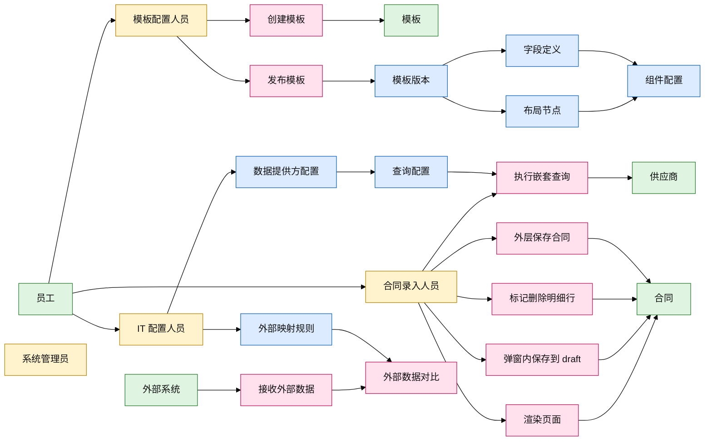

---

## 6. 4 + 1 视图

### 6.1 逻辑视图：一个后端应用，内部模块化

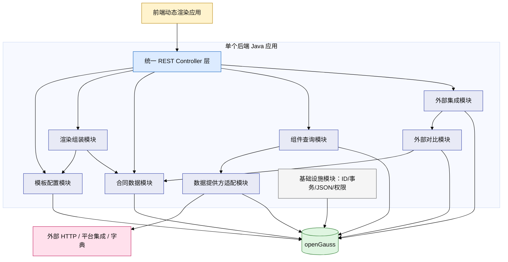

要点：

```text
1. 前端只知道一个后端应用。
2. 模板、合同、查询、外部集成都是后端应用内部模块。
3. 数据源/数据提供方只是配置记录，由 ProviderModule 解释执行。
4. V1.0 不拆微服务，不做服务间调用。
```

### 6.2 开发视图：模块不是服务

```text
com.company.contracttemplate
  ├── adapter
  │   ├── controller              // REST API
  │   ├── job                     // 定时任务，V1.1+
  │   └── persistence             // mapper/repository
  ├── application
  │   ├── template                // 模板应用服务
  │   ├── render                  // 渲染 schema 组装
  │   ├── contract                // 合同保存/回显
  │   ├── query                   // 组件查询执行
  │   ├── provider                // 数据提供方执行
  │   ├── integration             // 外部数据接入
  │   └── compare                 // 外部数据对比
  ├── domain
  │   ├── template                // 模板聚合规则
  │   ├── contract                // 合同聚合规则
  │   ├── query                   // 查询规则
  │   └── integration             // 映射和对比规则
  ├── infrastructure
  │   ├── id                      // 雪花 ID
  │   ├── json                    // JSONB/JSONPath 工具
  │   ├── datasource              // HTTP/平台 API 适配器
  │   ├── cache                   // V1.1+ 本地缓存/Redis
  │   └── transaction             // 事务封装
  └── common
      ├── exception
      ├── result
      └── enums
```

### 6.3 进程视图

V1.0：

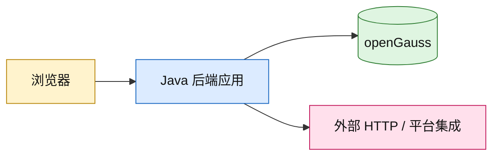

V1.1+：

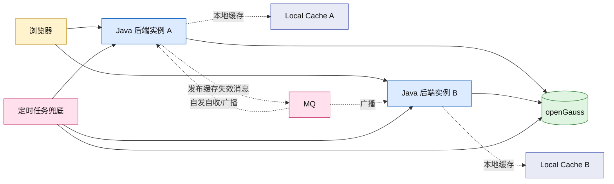

### 6.4 物理/拓扑视图

```mermaid
flowchart TB
    classDef client fill:#FFF3CD,stroke:#B8860B,color:#111
    classDef server fill:#DCEBFF,stroke:#1565C0,color:#111
    classDef db fill:#DFF5E1,stroke:#2E7D32,color:#111
    classDef future fill:#F5F5F5,stroke:#999,color:#111,stroke-dasharray: 5 5
    classDef ext fill:#FFE0EC,stroke:#C2185B,color:#111

    User[用户浏览器]:::client --> Nginx[Nginx/网关]:::server
    Nginx --> App[合同模板后端应用]:::server
    App --> DB[(openGauss 主库)]:::db
    DB -.可选.-> DBSlave[(openGauss 只读库)]:::future
    App -.V1.2 可选.-> Redis[(Redis)]:::future
    App -.V1.1 可选.-> MQ[MQ]:::future
    App --> Platform[公司平台集成服务]:::ext
    App --> HttpApi[外部 HTTP API]:::ext
```

### 6.5 场景视图

本系统最关键的场景不是“查看页面”，而是下面这些：

| 场景 | 是否 V1.0 | 说明 |
|---|---:|---|
| 配置简单模板 | 是 | 单页、卡片、普通字段 |
| 配置复杂嵌套模板 | 是 | 栅格、Tab、卡片、明细表、弹窗入口 |
| 按模板渲染新增合同页面 | 是 | 返回 schema + 空数据 |
| 按模板回显编辑合同页面 | 是 | 返回 schema + 当前快照数据 |
| 嵌套查询选择供应商 | 是 | 查询弹窗选择后回填 draft |
| 明细行弹窗编辑 | 是 | 内层保存合并 draft，外层保存落库 |
| 明细行删除 | 是 | draft 标记删除，外层保存时重建当前明细索引 |
| 外部数据进入并对比 | 是 | 外部数据映射成 canonical JSON 后对比 |
| 模板发布刷新缓存 | V1.1 | 当前不依赖缓存 |

---

## 7. 用例图

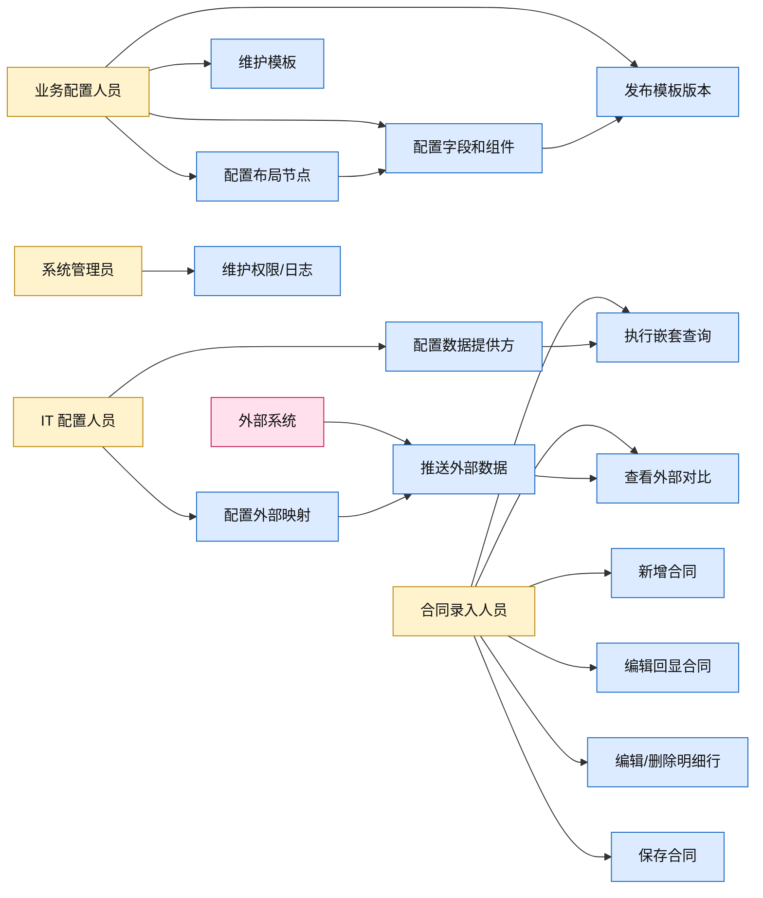

---

## 8. 低保真界面

### 8.1 简单界面：单页卡片表单

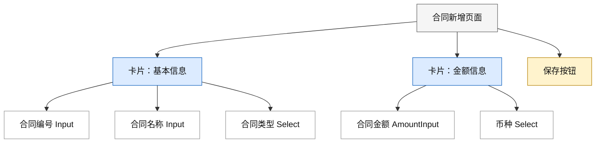

### 8.2 复杂界面：左右布局 + Tab + 明细表

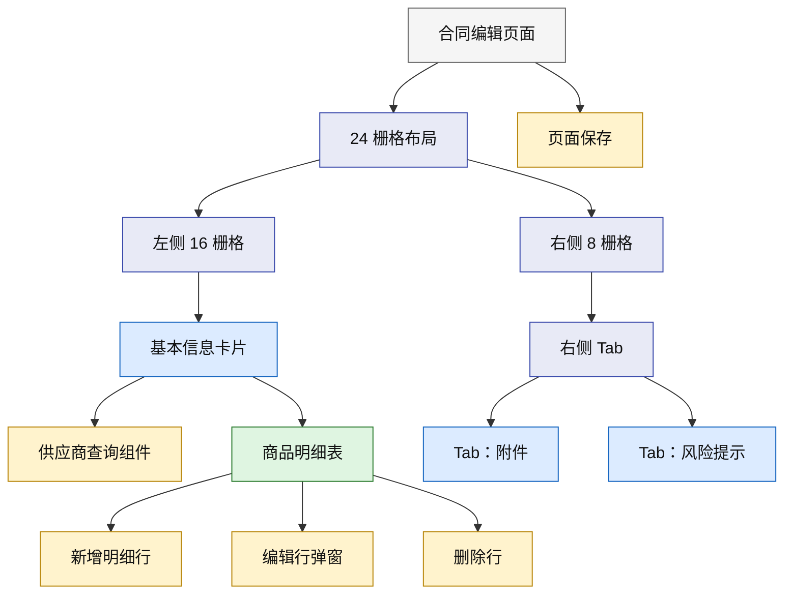

### 8.3 嵌套查询弹窗

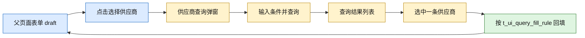

### 8.4 明细行弹窗编辑


---

## 9. 核心流程图

### 9.1 模板配置发布流程

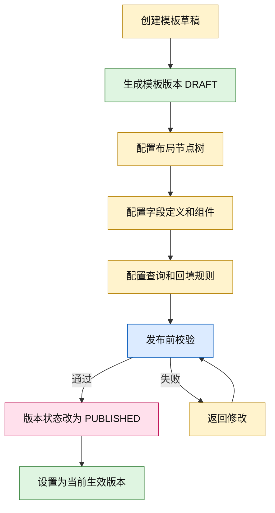

### 9.2 合同新增保存流程

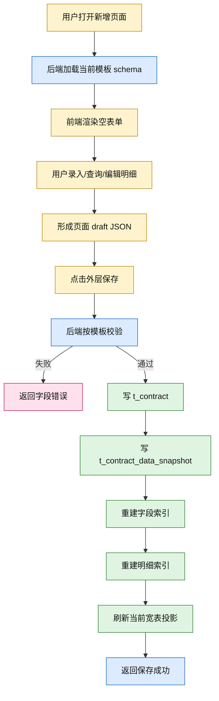

### 9.3 明细删除保存流程

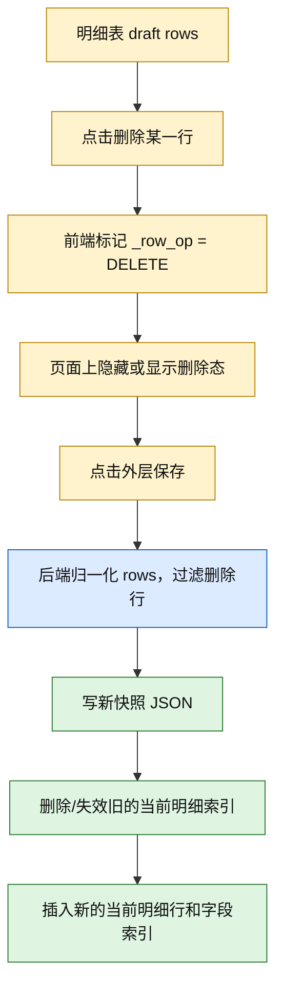

---

## 10. 时序图

### 10.1 渲染新增页面

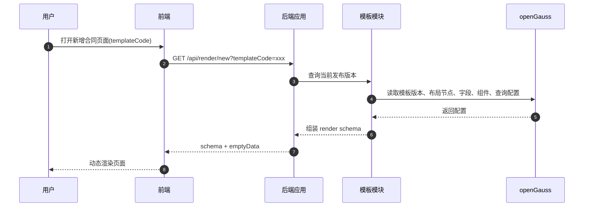

### 10.2 查询弹窗选择并回填

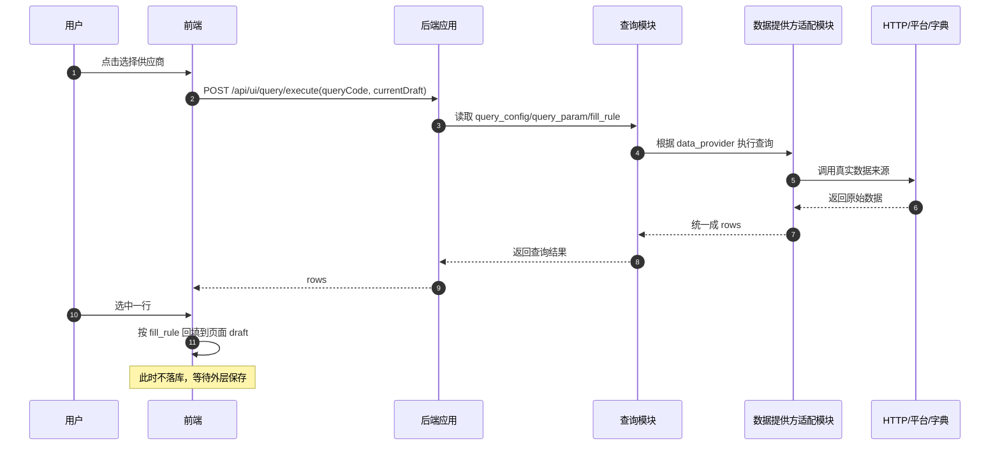

### 10.3 弹窗编辑明细行

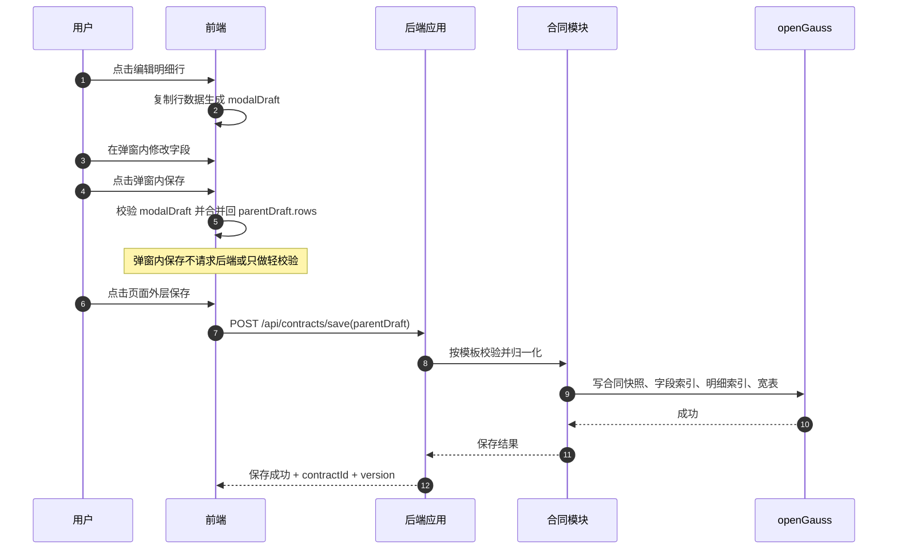

### 10.4 编辑回显

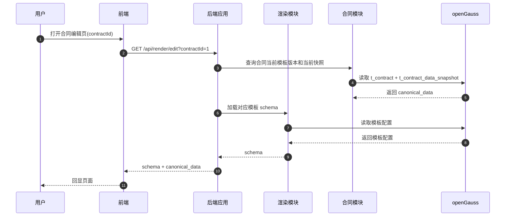

### 10.5 外部数据接入和对比

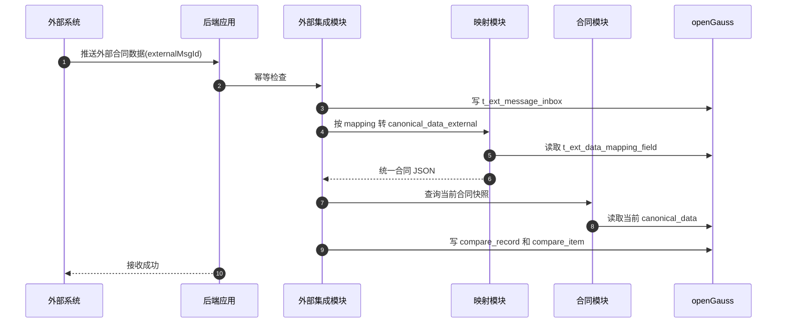

---

## 11. 前端组件支持清单

### 11.1 布局组件

| 组件 | V1.0 | 说明 |
|---|---:|---|
| `PAGE` | 是 | 页面根节点 |
| `CONTAINER` | 是 | 普通容器 |
| `GRID` | 是 | 栅格布局 |
| `ROW` | 是 | 行 |
| `COL` | 是 | 列 |
| `CARD` | 是 | 卡片 |
| `TABS` | 是 | Tab 容器 |
| `TAB_PANE` | 是 | Tab 页 |
| `COLLAPSE` | 是 | 折叠面板 |
| `COLLAPSE_PANEL` | 是 | 折叠项 |
| `DIVIDER` | 是 | 分割线 |
| `MODAL` | 是 | 弹窗容器 |
| `DRAWER` | V1.1 | 抽屉 |
| `CUSTOM_CONTAINER` | V2.0 | 插件容器 |

### 11.2 基础字段组件

| 组件 | V1.0 | 说明 |
|---|---:|---|
| `INPUT` | 是 | 单行文本 |
| `TEXTAREA` | 是 | 多行文本 |
| `NUMBER` | 是 | 数字 |
| `AMOUNT` | 是 | 金额 |
| `PERCENT` | 是 | 百分比 |
| `DATE` | 是 | 日期 |
| `DATETIME` | 是 | 日期时间 |
| `SELECT` | 是 | 下拉单选 |
| `MULTI_SELECT` | 是 | 下拉多选 |
| `RADIO` | 是 | 单选 |
| `CHECKBOX` | 是 | 多选 |
| `SWITCH` | 是 | 开关 |
| `FILE_UPLOAD` | 是 | 附件上传 |
| `READONLY_TEXT` | 是 | 只读展示 |
| `RICH_TEXT` | V1.1 | 富文本 |
| `CASCADER` | V1.1 | 级联 |
| `USER_SELECT` | V1.1 | 人员选择 |
| `ORG_SELECT` | V1.1 | 组织选择 |

### 11.3 业务/复合组件

| 组件 | V1.0 | 说明 |
|---|---:|---|
| `SUPPLIER_SELECT` | 是 | 供应商选择，通常绑定查询弹窗 |
| `CONTRACT_REF_SELECT` | 是 | 关联已有合同 |
| `DETAIL_TABLE` | 是 | 明细表 |
| `DETAIL_ROW_MODAL` | 是 | 明细行编辑弹窗 |
| `QUERY_FORM` | 是 | 查询条件区 |
| `QUERY_LIST` | 是 | 查询结果区 |
| `COMPARE_VIEW` | 是 | 外部数据对比 |
| `ATTACHMENT_LIST` | 是 | 附件列表 |
| `AUDIT_HISTORY` | V1.1 | 历史记录展示 |

### 11.4 动作组件

| 动作 | V1.0 | 说明 |
|---|---:|---|
| `OPEN_MODAL` | 是 | 打开弹窗 |
| `CLOSE_MODAL` | 是 | 关闭弹窗 |
| `QUERY` | 是 | 执行查询 |
| `FILL` | 是 | 回填 draft |
| `ADD_DETAIL_ROW` | 是 | 新增明细行 |
| `EDIT_DETAIL_ROW` | 是 | 编辑明细行 |
| `MARK_DELETE_ROW` | 是 | 标记删除明细行 |
| `RESTORE_DETAIL_ROW` | 是 | 恢复删除行 |
| `SAVE_MODAL_DRAFT` | 是 | 弹窗内保存到父 draft |
| `SAVE_CONTRACT` | 是 | 外层保存合同 |
| `RESET` | 是 | 重置当前区域 |

---

## 12. 数据模型总览

### 12.1 模板配置侧

```text
t_ui_template
  └── t_ui_template_version
        ├── t_ui_layout_node
        ├── t_ui_field_def
        ├── t_ui_field_component
        ├── t_ui_detail_table
        ├── t_ui_query_config
        ├── t_ui_query_param
        ├── t_ui_query_fill_rule
        └── t_ui_action_config
```

### 12.2 数据提供方侧

```text
t_ui_data_provider
  └── t_ui_data_option
```

说明：

```text
数据提供方不是服务，只是配置。
组件通过 query_config 引用 data_provider。
后端根据 data_provider 去 HTTP、平台集成、字典、静态选项取数据。
```

### 12.3 合同数据侧

```text
t_contract
  ├── t_contract_data_snapshot
  ├── t_contract_field_value
  ├── t_contract_detail_row
  ├── t_contract_detail_field_value
  ├── t_contract_search_index
  └── t_contract_attachment
```

### 12.4 外部集成侧

```text
t_ext_system
  ├── t_ext_message_inbox
  ├── t_ext_data_mapping
  ├── t_ext_data_mapping_field
  ├── t_ext_compare_record
  └── t_ext_compare_item
```

### 12.5 不放进核心 ER 的公共能力

| 表/能力 | 本版处理 |
|---|---|
| `t_sys_snowflake_worker` | 如果没有统一 ID 服务，可作为公共基础表；不属于合同业务 ER |
| `t_sys_operation_log` | 通用操作日志，平台已有则复用；不和本系统核心表强绑定 |
| `t_sys_outbox_msg` | V1.0 不建；V1.1 视 MQ 方案决定是否使用 |
| `t_sys_cache_event` | V1.0 不建；本地缓存/Redis 后再定 |

---

## 13. ER 图

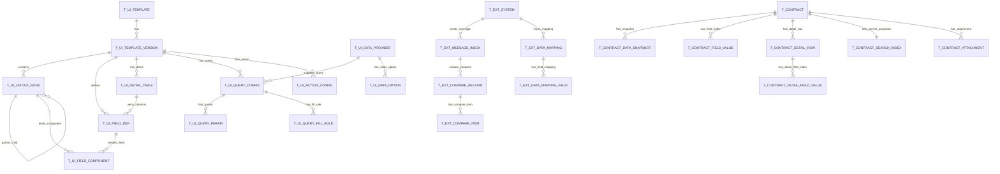

---

## 14. 表清单和版本划分

| 分类 | 表名 | 作用 | V1.0 |
|---|---|---|---:|
| 模板 | `t_ui_template` | 模板主表 | 是 |
| 模板 | `t_ui_template_version` | 模板版本 | 是 |
| 模板 | `t_ui_layout_node` | 布局节点树 | 是 |
| 模板 | `t_ui_field_def` | 字段定义 | 是 |
| 模板 | `t_ui_field_component` | 字段组件绑定 | 是 |
| 模板 | `t_ui_detail_table` | 明细表配置 | 是 |
| 模板 | `t_ui_query_config` | 查询配置 | 是 |
| 模板 | `t_ui_query_param` | 查询参数绑定 | 是 |
| 模板 | `t_ui_query_fill_rule` | 查询结果回填规则 | 是 |
| 模板 | `t_ui_action_config` | 动作配置 | 是 |
| 数据提供方 | `t_ui_data_provider` | IT 配置的数据提供方 | 是 |
| 数据提供方 | `t_ui_data_option` | 静态选项/字典项 | 是 |
| 合同 | `t_contract` | 合同主表 | 是 |
| 合同 | `t_contract_data_snapshot` | 合同 JSON 快照 | 是 |
| 合同 | `t_contract_field_value` | 字段值索引 | 是 |
| 合同 | `t_contract_detail_row` | 明细行当前投影 | 是 |
| 合同 | `t_contract_detail_field_value` | 明细字段索引 | 是 |
| 合同 | `t_contract_search_index` | 当前查询宽表 | 是 |
| 合同 | `t_contract_attachment` | 附件 | 是 |
| 外部 | `t_ext_system` | 外部系统登记 | 是 |
| 外部 | `t_ext_message_inbox` | 外部消息幂等入库 | 是 |
| 外部 | `t_ext_data_mapping` | 外部映射主表 | 是 |
| 外部 | `t_ext_data_mapping_field` | 外部字段映射 | 是 |
| 外部 | `t_ext_compare_record` | 外部对比记录 | 是 |
| 外部 | `t_ext_compare_item` | 外部对比明细 | 是 |
| 公共 | `t_sys_snowflake_worker` | worker 分配，公共可选 | 可选 |
| 公共 | `t_sys_operation_log` | 通用操作日志，复用平台 | 不作为核心 |
| 缓存/MQ | outbox/cache_event | 视 V1.1 技术方案决定 | 否 |

---

## 15. 表详细设计说明

### 15.1 模板主表：`t_ui_template`

**为什么需要：** 表示一个模板，例如“采购合同模板”。它不直接存布局，布局在版本里。

**是否运行时中间表：** 否，是模板主数据。

**谁维护：** 业务配置人员。

```sql
CREATE TABLE t_ui_template (
    id BIGINT PRIMARY KEY,
    template_code VARCHAR(100) NOT NULL,
    template_name VARCHAR(200) NOT NULL,
    template_desc VARCHAR(1000),
    biz_type VARCHAR(100),
    status VARCHAR(50) NOT NULL DEFAULT 'ENABLED',
    current_version_id BIGINT,
    created_by BIGINT,
    created_name VARCHAR(100),
    created_at TIMESTAMPTZ NOT NULL DEFAULT CURRENT_TIMESTAMP,
    updated_by BIGINT,
    updated_name VARCHAR(100),
    updated_at TIMESTAMPTZ NOT NULL DEFAULT CURRENT_TIMESTAMP,
    is_deleted SMALLINT NOT NULL DEFAULT 0,
    CONSTRAINT uk_ui_template_code UNIQUE (template_code)
);

COMMENT ON TABLE t_ui_template IS '模板主表，表示一个业务模板，不直接存布局内容';
COMMENT ON COLUMN t_ui_template.id IS '主键，雪花ID';
COMMENT ON COLUMN t_ui_template.template_code IS '模板编码，全局唯一，例如 PURCHASE_CONTRACT';
COMMENT ON COLUMN t_ui_template.current_version_id IS '当前发布版本ID，指向t_ui_template_version.id';
```

### 15.2 模板版本表：`t_ui_template_version`

**为什么需要：** 模板发布后不能随意改。改模板应该复制一个草稿版本，发布后再切当前版本。

**是否运行时中间表：** 否，是模板配置版本。

```sql
CREATE TABLE t_ui_template_version (
    id BIGINT PRIMARY KEY,
    template_id BIGINT NOT NULL,
    version_no INTEGER NOT NULL,
    version_name VARCHAR(200),
    version_status VARCHAR(50) NOT NULL DEFAULT 'DRAFT',
    publish_time TIMESTAMPTZ,
    publish_by BIGINT,
    schema_hash VARCHAR(128),
    remark VARCHAR(1000),
    created_by BIGINT,
    created_name VARCHAR(100),
    created_at TIMESTAMPTZ NOT NULL DEFAULT CURRENT_TIMESTAMP,
    updated_by BIGINT,
    updated_name VARCHAR(100),
    updated_at TIMESTAMPTZ NOT NULL DEFAULT CURRENT_TIMESTAMP,
    is_deleted SMALLINT NOT NULL DEFAULT 0,
    CONSTRAINT uk_ui_template_version UNIQUE (template_id, version_no)
);

CREATE INDEX idx_ui_template_version_status ON t_ui_template_version (template_id, version_status);

COMMENT ON TABLE t_ui_template_version IS '模板版本表，草稿、发布和历史版本都在这里';
COMMENT ON COLUMN t_ui_template_version.version_status IS '版本状态：DRAFT草稿、PUBLISHED已发布、DISABLED停用';
```

### 15.3 布局节点树：`t_ui_layout_node`

**为什么需要：** 替代简单 section。页面上每个容器、卡片、Tab、弹窗、字段位置、明细表，都可以是一个节点。

**是否运行时中间表：** 否，是模板布局配置。

**关键点：** `parent_id` 支持嵌套；`grid_x/grid_y/grid_w/grid_h` 支持位置；`bind_type/bind_ref_id` 绑定字段、明细表、查询或动作。

```sql
CREATE TABLE t_ui_layout_node (
    id BIGINT PRIMARY KEY,
    template_id BIGINT NOT NULL,
    template_version_id BIGINT NOT NULL,
    parent_id BIGINT,
    node_code VARCHAR(100) NOT NULL,
    node_name VARCHAR(200),
    node_type VARCHAR(50) NOT NULL,
    sort_no INTEGER NOT NULL DEFAULT 0,
    level_no INTEGER NOT NULL DEFAULT 1,
    node_path VARCHAR(1000),

    grid_x INTEGER,
    grid_y INTEGER,
    grid_w INTEGER,
    grid_h INTEGER,
    row_no INTEGER,
    col_no INTEGER,
    col_span INTEGER,
    row_span INTEGER,

    bind_type VARCHAR(50),
    bind_ref_id BIGINT,

    visible_rule JSONB,
    readonly_rule JSONB,
    props_json JSONB,

    created_by BIGINT,
    created_at TIMESTAMPTZ NOT NULL DEFAULT CURRENT_TIMESTAMP,
    updated_by BIGINT,
    updated_at TIMESTAMPTZ NOT NULL DEFAULT CURRENT_TIMESTAMP,
    is_deleted SMALLINT NOT NULL DEFAULT 0,
    CONSTRAINT uk_ui_layout_node_code UNIQUE (template_version_id, node_code)
);

CREATE INDEX idx_ui_layout_parent ON t_ui_layout_node (template_version_id, parent_id, sort_no);
CREATE INDEX idx_ui_layout_bind ON t_ui_layout_node (bind_type, bind_ref_id);

COMMENT ON TABLE t_ui_layout_node IS '布局节点树，表达页面、容器、卡片、Tab、字段位置、明细表、弹窗等';
COMMENT ON COLUMN t_ui_layout_node.node_type IS '节点类型：PAGE、GRID、ROW、COL、CARD、TABS、TAB_PANE、MODAL、FIELD、DETAIL_TABLE、QUERY、ACTION等';
COMMENT ON COLUMN t_ui_layout_node.bind_type IS '绑定类型：FIELD_DEF、DETAIL_TABLE、QUERY_CONFIG、ACTION_CONFIG、CUSTOM_COMPONENT';
```

### 15.4 字段定义表：`t_ui_field_def`

**为什么需要：** 字段是业务数据结构的一部分，不等于前端组件。同一个字段可以在不同布局位置用不同方式显示。

**是否运行时中间表：** 否，是模板字段定义。

```sql
CREATE TABLE t_ui_field_def (
    id BIGINT PRIMARY KEY,
    template_id BIGINT NOT NULL,
    template_version_id BIGINT NOT NULL,
    detail_table_id BIGINT,
    field_code VARCHAR(100) NOT NULL,
    field_path VARCHAR(500) NOT NULL,
    field_name_cn VARCHAR(200) NOT NULL,
    field_name_en VARCHAR(200),
    data_type VARCHAR(50) NOT NULL,
    value_type VARCHAR(50) NOT NULL DEFAULT 'SINGLE',
    required_default SMALLINT NOT NULL DEFAULT 0,
    searchable SMALLINT NOT NULL DEFAULT 0,
    indexable SMALLINT NOT NULL DEFAULT 0,
    search_index_column VARCHAR(100),
    default_value VARCHAR(1000),
    validate_rule JSONB,
    props_json JSONB,
    created_by BIGINT,
    created_at TIMESTAMPTZ NOT NULL DEFAULT CURRENT_TIMESTAMP,
    updated_by BIGINT,
    updated_at TIMESTAMPTZ NOT NULL DEFAULT CURRENT_TIMESTAMP,
    is_deleted SMALLINT NOT NULL DEFAULT 0,
    CONSTRAINT uk_ui_field_path UNIQUE (template_version_id, field_path)
);

CREATE INDEX idx_ui_field_version ON t_ui_field_def (template_version_id);
CREATE INDEX idx_ui_field_detail ON t_ui_field_def (detail_table_id);

COMMENT ON TABLE t_ui_field_def IS '字段定义表，描述合同统一数据里的字段路径、类型和查询索引属性';
COMMENT ON COLUMN t_ui_field_def.field_path IS '统一数据路径，例如 basic.contractNo、items[].itemName';
COMMENT ON COLUMN t_ui_field_def.detail_table_id IS '如果字段属于明细表，关联t_ui_detail_table.id';
COMMENT ON COLUMN t_ui_field_def.searchable IS '是否允许作为查询条件';
COMMENT ON COLUMN t_ui_field_def.indexable IS '保存合同时是否写入字段索引表';
```

### 15.5 字段组件绑定表：`t_ui_field_component`

**为什么需要：** 字段定义只说明“是什么数据”，组件绑定说明“怎么展示、怎么录入”。

```sql
CREATE TABLE t_ui_field_component (
    id BIGINT PRIMARY KEY,
    template_id BIGINT NOT NULL,
    template_version_id BIGINT NOT NULL,
    layout_node_id BIGINT NOT NULL,
    field_def_id BIGINT NOT NULL,
    component_type VARCHAR(50) NOT NULL,
    label_name VARCHAR(200),
    placeholder VARCHAR(300),
    required_rule JSONB,
    readonly_rule JSONB,
    visible_rule JSONB,
    component_props JSONB,
    data_provider_id BIGINT,
    sort_no INTEGER NOT NULL DEFAULT 0,
    created_by BIGINT,
    created_at TIMESTAMPTZ NOT NULL DEFAULT CURRENT_TIMESTAMP,
    updated_by BIGINT,
    updated_at TIMESTAMPTZ NOT NULL DEFAULT CURRENT_TIMESTAMP,
    is_deleted SMALLINT NOT NULL DEFAULT 0,
    CONSTRAINT uk_ui_field_component UNIQUE (template_version_id, layout_node_id, field_def_id)
);

CREATE INDEX idx_ui_field_component_node ON t_ui_field_component (layout_node_id);
CREATE INDEX idx_ui_field_component_field ON t_ui_field_component (field_def_id);

COMMENT ON TABLE t_ui_field_component IS '字段组件绑定表，定义某个布局节点上的字段用什么组件展示';
COMMENT ON COLUMN t_ui_field_component.data_provider_id IS '下拉、远程搜索等组件可直接引用数据提供方';
```

### 15.6 明细表配置：`t_ui_detail_table`

**为什么需要：** 明细表不是普通字段。它有行、列、增删改、行状态、排序和回显。

```sql
CREATE TABLE t_ui_detail_table (
    id BIGINT PRIMARY KEY,
    template_id BIGINT NOT NULL,
    template_version_id BIGINT NOT NULL,
    detail_code VARCHAR(100) NOT NULL,
    detail_name VARCHAR(200) NOT NULL,
    detail_path VARCHAR(500) NOT NULL,
    row_key_strategy VARCHAR(50) NOT NULL DEFAULT 'CLIENT_UUID',
    min_rows INTEGER DEFAULT 0,
    max_rows INTEGER,
    allow_add SMALLINT NOT NULL DEFAULT 1,
    allow_edit SMALLINT NOT NULL DEFAULT 1,
    allow_delete SMALLINT NOT NULL DEFAULT 1,
    delete_mode VARCHAR(50) NOT NULL DEFAULT 'MARK_IN_DRAFT',
    props_json JSONB,
    created_by BIGINT,
    created_at TIMESTAMPTZ NOT NULL DEFAULT CURRENT_TIMESTAMP,
    updated_by BIGINT,
    updated_at TIMESTAMPTZ NOT NULL DEFAULT CURRENT_TIMESTAMP,
    is_deleted SMALLINT NOT NULL DEFAULT 0,
    CONSTRAINT uk_ui_detail_code UNIQUE (template_version_id, detail_code)
);

COMMENT ON TABLE t_ui_detail_table IS '明细表配置，定义合同JSON中的数组区域和增删改行为';
COMMENT ON COLUMN t_ui_detail_table.detail_path IS '明细数组路径，例如 items';
COMMENT ON COLUMN t_ui_detail_table.delete_mode IS '删除模式，V1.0使用MARK_IN_DRAFT，最终保存时过滤或归档';
```

### 15.7 数据提供方配置：`t_ui_data_provider`

**为什么需要：** IT 配置“组件数据从哪里来”。它只是记录，不是服务。

```sql
CREATE TABLE t_ui_data_provider (
    id BIGINT PRIMARY KEY,
    provider_code VARCHAR(100) NOT NULL,
    provider_name VARCHAR(200) NOT NULL,
    provider_type VARCHAR(50) NOT NULL,
    owner_type VARCHAR(50) NOT NULL DEFAULT 'IT',
    request_method VARCHAR(20),
    request_url VARCHAR(1000),
    platform_api_code VARCHAR(200),
    request_mapping_json JSONB,
    response_mapping_json JSONB,
    timeout_ms INTEGER NOT NULL DEFAULT 5000,
    cacheable SMALLINT NOT NULL DEFAULT 0,
    cache_ttl_seconds INTEGER,
    status VARCHAR(50) NOT NULL DEFAULT 'ENABLED',
    props_json JSONB,
    created_by BIGINT,
    created_name VARCHAR(100),
    created_at TIMESTAMPTZ NOT NULL DEFAULT CURRENT_TIMESTAMP,
    updated_by BIGINT,
    updated_name VARCHAR(100),
    updated_at TIMESTAMPTZ NOT NULL DEFAULT CURRENT_TIMESTAMP,
    is_deleted SMALLINT NOT NULL DEFAULT 0,
    CONSTRAINT uk_ui_data_provider_code UNIQUE (provider_code)
);

COMMENT ON TABLE t_ui_data_provider IS '数据提供方配置，由IT维护，供查询组件和下拉组件取数';
COMMENT ON COLUMN t_ui_data_provider.provider_type IS 'STATIC、DICT、HTTP、PLATFORM_API、INTERNAL_QUERY';
COMMENT ON COLUMN t_ui_data_provider.request_url IS 'HTTP类型的数据来源地址，前端不可见';
COMMENT ON COLUMN t_ui_data_provider.platform_api_code IS '平台集成类型的服务编码';
```

### 15.8 静态选项表：`t_ui_data_option`

```sql
CREATE TABLE t_ui_data_option (
    id BIGINT PRIMARY KEY,
    provider_id BIGINT NOT NULL,
    option_value VARCHAR(200) NOT NULL,
    option_label VARCHAR(200) NOT NULL,
    parent_value VARCHAR(200),
    sort_no INTEGER NOT NULL DEFAULT 0,
    status VARCHAR(50) NOT NULL DEFAULT 'ENABLED',
    ext_json JSONB,
    created_by BIGINT,
    created_at TIMESTAMPTZ NOT NULL DEFAULT CURRENT_TIMESTAMP,
    updated_by BIGINT,
    updated_at TIMESTAMPTZ NOT NULL DEFAULT CURRENT_TIMESTAMP,
    is_deleted SMALLINT NOT NULL DEFAULT 0,
    CONSTRAINT uk_ui_data_option UNIQUE (provider_id, option_value)
);

CREATE INDEX idx_ui_data_option_provider ON t_ui_data_option (provider_id, sort_no);

COMMENT ON TABLE t_ui_data_option IS '静态选项表，provider_type为STATIC或DICT时使用';
```

### 15.9 查询配置：`t_ui_query_config`

**为什么需要：** 查询弹窗、远程搜索、查询列表需要知道使用哪个数据提供方、单选还是多选、怎么触发。

```sql
CREATE TABLE t_ui_query_config (
    id BIGINT PRIMARY KEY,
    template_id BIGINT NOT NULL,
    template_version_id BIGINT NOT NULL,
    query_code VARCHAR(100) NOT NULL,
    query_name VARCHAR(200) NOT NULL,
    query_type VARCHAR(50) NOT NULL,
    data_provider_id BIGINT NOT NULL,
    trigger_type VARCHAR(50) NOT NULL DEFAULT 'MANUAL',
    result_mode VARCHAR(50) NOT NULL DEFAULT 'SINGLE_SELECT',
    bind_node_id BIGINT,
    page_size INTEGER DEFAULT 20,
    props_json JSONB,
    created_by BIGINT,
    created_at TIMESTAMPTZ NOT NULL DEFAULT CURRENT_TIMESTAMP,
    updated_by BIGINT,
    updated_at TIMESTAMPTZ NOT NULL DEFAULT CURRENT_TIMESTAMP,
    is_deleted SMALLINT NOT NULL DEFAULT 0,
    CONSTRAINT uk_ui_query_code UNIQUE (template_version_id, query_code)
);

CREATE INDEX idx_ui_query_version ON t_ui_query_config (template_version_id);
CREATE INDEX idx_ui_query_provider ON t_ui_query_config (data_provider_id);

COMMENT ON TABLE t_ui_query_config IS '查询配置表，定义某个查询组件如何取数';
COMMENT ON COLUMN t_ui_query_config.data_provider_id IS '引用t_ui_data_provider.id，说明该查询的数据来自哪里';
```

### 15.10 查询参数绑定：`t_ui_query_param`

**为什么需要：** 查询条件可能来自当前表单字段、当前明细行、固定值、系统变量。

```sql
CREATE TABLE t_ui_query_param (
    id BIGINT PRIMARY KEY,
    query_config_id BIGINT NOT NULL,
    param_name VARCHAR(100) NOT NULL,
    param_label VARCHAR(200),
    bind_source VARCHAR(50) NOT NULL,
    bind_path VARCHAR(500),
    component_type VARCHAR(50),
    required SMALLINT NOT NULL DEFAULT 0,
    default_value VARCHAR(1000),
    sort_no INTEGER NOT NULL DEFAULT 0,
    created_by BIGINT,
    created_at TIMESTAMPTZ NOT NULL DEFAULT CURRENT_TIMESTAMP,
    updated_by BIGINT,
    updated_at TIMESTAMPTZ NOT NULL DEFAULT CURRENT_TIMESTAMP,
    is_deleted SMALLINT NOT NULL DEFAULT 0,
    CONSTRAINT uk_ui_query_param UNIQUE (query_config_id, param_name)
);

COMMENT ON TABLE t_ui_query_param IS '查询参数绑定表，定义查询参数从页面draft、当前行、固定值或系统变量获取';
COMMENT ON COLUMN t_ui_query_param.bind_source IS 'FORM、CURRENT_ROW、FIXED、SYSTEM、USER_INPUT';
```

### 15.11 查询回填规则：`t_ui_query_fill_rule`

**为什么需要：** 它不是中间过程，是配置。用户选中查询结果后，前端按这个规则把结果字段填入 draft。

```sql
CREATE TABLE t_ui_query_fill_rule (
    id BIGINT PRIMARY KEY,
    query_config_id BIGINT NOT NULL,
    source_field VARCHAR(300) NOT NULL,
    target_scope VARCHAR(50) NOT NULL DEFAULT 'FORM',
    target_path VARCHAR(500) NOT NULL,
    fill_mode VARCHAR(50) NOT NULL DEFAULT 'OVERWRITE',
    transform_json JSONB,
    sort_no INTEGER NOT NULL DEFAULT 0,
    created_by BIGINT,
    created_at TIMESTAMPTZ NOT NULL DEFAULT CURRENT_TIMESTAMP,
    updated_by BIGINT,
    updated_at TIMESTAMPTZ NOT NULL DEFAULT CURRENT_TIMESTAMP,
    is_deleted SMALLINT NOT NULL DEFAULT 0
);

CREATE INDEX idx_ui_query_fill_rule ON t_ui_query_fill_rule (query_config_id, sort_no);

COMMENT ON TABLE t_ui_query_fill_rule IS '查询结果回填规则配置，不保存运行时数据';
COMMENT ON COLUMN t_ui_query_fill_rule.target_scope IS 'FORM父表单、CURRENT_ROW当前明细行、MODAL_DRAFT弹窗草稿';
COMMENT ON COLUMN t_ui_query_fill_rule.fill_mode IS 'OVERWRITE覆盖、KEEP_IF_NOT_EMPTY非空不覆盖、APPEND追加';
```

### 15.12 动作配置：`t_ui_action_config`

```sql
CREATE TABLE t_ui_action_config (
    id BIGINT PRIMARY KEY,
    template_id BIGINT NOT NULL,
    template_version_id BIGINT NOT NULL,
    action_code VARCHAR(100) NOT NULL,
    action_name VARCHAR(200) NOT NULL,
    action_type VARCHAR(50) NOT NULL,
    bind_node_id BIGINT,
    bind_query_id BIGINT,
    confirm_required SMALLINT NOT NULL DEFAULT 0,
    confirm_text VARCHAR(500),
    before_rule JSONB,
    after_rule JSONB,
    props_json JSONB,
    sort_no INTEGER NOT NULL DEFAULT 0,
    created_by BIGINT,
    created_at TIMESTAMPTZ NOT NULL DEFAULT CURRENT_TIMESTAMP,
    updated_by BIGINT,
    updated_at TIMESTAMPTZ NOT NULL DEFAULT CURRENT_TIMESTAMP,
    is_deleted SMALLINT NOT NULL DEFAULT 0,
    CONSTRAINT uk_ui_action_code UNIQUE (template_version_id, action_code)
);

COMMENT ON TABLE t_ui_action_config IS '动作配置表，定义按钮或组件动作，如查询、打开弹窗、保存弹窗草稿、外层保存';
COMMENT ON COLUMN t_ui_action_config.action_type IS 'OPEN_MODAL、QUERY、FILL、ADD_DETAIL_ROW、EDIT_DETAIL_ROW、MARK_DELETE_ROW、SAVE_MODAL_DRAFT、SAVE_CONTRACT等';
```

### 15.13 合同主表：`t_contract`

```sql
CREATE TABLE t_contract (
    id BIGINT PRIMARY KEY,
    contract_no VARCHAR(100),
    contract_name VARCHAR(300),
    template_id BIGINT NOT NULL,
    template_version_id BIGINT NOT NULL,
    current_snapshot_id BIGINT,
    contract_status VARCHAR(50) NOT NULL DEFAULT 'DRAFT',
    data_version INTEGER NOT NULL DEFAULT 0,
    source_type VARCHAR(50) NOT NULL DEFAULT 'MANUAL',
    source_system_code VARCHAR(100),
    source_biz_id VARCHAR(200),
    created_by BIGINT,
    created_name VARCHAR(100),
    created_at TIMESTAMPTZ NOT NULL DEFAULT CURRENT_TIMESTAMP,
    updated_by BIGINT,
    updated_name VARCHAR(100),
    updated_at TIMESTAMPTZ NOT NULL DEFAULT CURRENT_TIMESTAMP,
    is_deleted SMALLINT NOT NULL DEFAULT 0
);

CREATE INDEX idx_contract_template ON t_contract (template_id, template_version_id);
CREATE INDEX idx_contract_no ON t_contract (contract_no);
CREATE INDEX idx_contract_source ON t_contract (source_system_code, source_biz_id);

COMMENT ON TABLE t_contract IS '合同主表，保存当前合同状态和当前快照指针';
COMMENT ON COLUMN t_contract.data_version IS '乐观锁版本号，防止并发覆盖';
```

### 15.14 合同快照：`t_contract_data_snapshot`

```sql
CREATE TABLE t_contract_data_snapshot (
    id BIGINT PRIMARY KEY,
    contract_id BIGINT NOT NULL,
    snapshot_no INTEGER NOT NULL,
    template_id BIGINT NOT NULL,
    template_version_id BIGINT NOT NULL,
    canonical_data JSONB NOT NULL,
    source_type VARCHAR(50) NOT NULL DEFAULT 'MANUAL',
    source_message_id BIGINT,
    save_reason VARCHAR(500),
    created_by BIGINT,
    created_name VARCHAR(100),
    created_at TIMESTAMPTZ NOT NULL DEFAULT CURRENT_TIMESTAMP,
    CONSTRAINT uk_contract_snapshot_no UNIQUE (contract_id, snapshot_no)
);

CREATE INDEX idx_contract_snapshot_contract ON t_contract_data_snapshot (contract_id, snapshot_no DESC);

COMMENT ON TABLE t_contract_data_snapshot IS '合同完整JSON快照，每次外层保存生成一条';
COMMENT ON COLUMN t_contract_data_snapshot.canonical_data IS '统一合同JSON数据，作为回显和历史追溯的权威数据';
```

### 15.15 字段值索引：`t_contract_field_value`

```sql
CREATE TABLE t_contract_field_value (
    id BIGINT PRIMARY KEY,
    contract_id BIGINT NOT NULL,
    snapshot_id BIGINT NOT NULL,
    template_version_id BIGINT NOT NULL,
    field_def_id BIGINT NOT NULL,
    field_path VARCHAR(500) NOT NULL,
    value_text TEXT,
    value_number NUMERIC(24, 6),
    value_date DATE,
    value_datetime TIMESTAMPTZ,
    value_bool SMALLINT,
    value_json JSONB,
    created_by BIGINT,
    created_at TIMESTAMPTZ NOT NULL DEFAULT CURRENT_TIMESTAMP,
    updated_by BIGINT,
    updated_at TIMESTAMPTZ NOT NULL DEFAULT CURRENT_TIMESTAMP,
    is_deleted SMALLINT NOT NULL DEFAULT 0
);

CREATE INDEX idx_contract_field_text ON t_contract_field_value (field_path, value_text);
CREATE INDEX idx_contract_field_number ON t_contract_field_value (field_path, value_number);
CREATE INDEX idx_contract_field_date ON t_contract_field_value (field_path, value_date);
CREATE INDEX idx_contract_field_contract ON t_contract_field_value (contract_id, snapshot_id);

COMMENT ON TABLE t_contract_field_value IS '合同字段值索引表，用于动态字段查询，不作为完整数据来源';
```

### 15.16 明细行当前投影：`t_contract_detail_row`

```sql
CREATE TABLE t_contract_detail_row (
    id BIGINT PRIMARY KEY,
    contract_id BIGINT NOT NULL,
    snapshot_id BIGINT NOT NULL,
    template_version_id BIGINT NOT NULL,
    detail_table_id BIGINT NOT NULL,
    detail_code VARCHAR(100) NOT NULL,
    row_uid VARCHAR(100) NOT NULL,
    row_no INTEGER NOT NULL,
    row_data JSONB NOT NULL,
    row_status VARCHAR(50) NOT NULL DEFAULT 'ACTIVE',
    created_by BIGINT,
    created_at TIMESTAMPTZ NOT NULL DEFAULT CURRENT_TIMESTAMP,
    updated_by BIGINT,
    updated_at TIMESTAMPTZ NOT NULL DEFAULT CURRENT_TIMESTAMP,
    is_deleted SMALLINT NOT NULL DEFAULT 0,
    CONSTRAINT uk_contract_detail_row_uid UNIQUE (contract_id, detail_code, row_uid)
);

CREATE INDEX idx_contract_detail_row ON t_contract_detail_row (contract_id, detail_code, row_no);

COMMENT ON TABLE t_contract_detail_row IS '合同明细行当前投影，用于明细查询和回显辅助，权威数据仍是快照JSON';
```

### 15.17 明细字段索引：`t_contract_detail_field_value`

```sql
CREATE TABLE t_contract_detail_field_value (
    id BIGINT PRIMARY KEY,
    contract_id BIGINT NOT NULL,
    detail_row_id BIGINT NOT NULL,
    snapshot_id BIGINT NOT NULL,
    detail_code VARCHAR(100) NOT NULL,
    row_uid VARCHAR(100) NOT NULL,
    field_def_id BIGINT NOT NULL,
    field_path VARCHAR(500) NOT NULL,
    value_text TEXT,
    value_number NUMERIC(24, 6),
    value_date DATE,
    value_datetime TIMESTAMPTZ,
    value_bool SMALLINT,
    value_json JSONB,
    created_by BIGINT,
    created_at TIMESTAMPTZ NOT NULL DEFAULT CURRENT_TIMESTAMP,
    updated_by BIGINT,
    updated_at TIMESTAMPTZ NOT NULL DEFAULT CURRENT_TIMESTAMP,
    is_deleted SMALLINT NOT NULL DEFAULT 0
);

CREATE INDEX idx_detail_field_text ON t_contract_detail_field_value (detail_code, field_path, value_text);
CREATE INDEX idx_detail_field_number ON t_contract_detail_field_value (detail_code, field_path, value_number);
CREATE INDEX idx_detail_field_contract ON t_contract_detail_field_value (contract_id, detail_code);

COMMENT ON TABLE t_contract_detail_field_value IS '明细字段索引表，用于明细行内动态字段查询';
```

### 15.18 当前查询宽表：`t_contract_search_index`

```sql
CREATE TABLE t_contract_search_index (
    contract_id BIGINT PRIMARY KEY,
    contract_no VARCHAR(100),
    contract_name VARCHAR(300),
    supplier_id VARCHAR(100),
    supplier_name VARCHAR(300),
    contract_type VARCHAR(100),
    total_amount NUMERIC(24, 6),
    currency VARCHAR(20),
    sign_date DATE,
    effective_date DATE,
    expire_date DATE,
    contract_status VARCHAR(50),
    source_system_code VARCHAR(100),
    current_snapshot_id BIGINT NOT NULL,
    created_by BIGINT,
    created_at TIMESTAMPTZ NOT NULL DEFAULT CURRENT_TIMESTAMP,
    updated_by BIGINT,
    updated_at TIMESTAMPTZ NOT NULL DEFAULT CURRENT_TIMESTAMP
);

CREATE INDEX idx_contract_search_supplier ON t_contract_search_index (supplier_name);
CREATE INDEX idx_contract_search_status ON t_contract_search_index (contract_status);
CREATE INDEX idx_contract_search_date ON t_contract_search_index (sign_date);

COMMENT ON TABLE t_contract_search_index IS '当前合同查询宽表，只存高频列表字段，便于列表筛选和排序';
```

### 15.19 附件表：`t_contract_attachment`

```sql
CREATE TABLE t_contract_attachment (
    id BIGINT PRIMARY KEY,
    contract_id BIGINT NOT NULL,
    snapshot_id BIGINT,
    file_id VARCHAR(200) NOT NULL,
    file_name VARCHAR(300) NOT NULL,
    file_type VARCHAR(100),
    file_size BIGINT,
    biz_path VARCHAR(500),
    created_by BIGINT,
    created_at TIMESTAMPTZ NOT NULL DEFAULT CURRENT_TIMESTAMP,
    updated_by BIGINT,
    updated_at TIMESTAMPTZ NOT NULL DEFAULT CURRENT_TIMESTAMP,
    is_deleted SMALLINT NOT NULL DEFAULT 0
);

CREATE INDEX idx_contract_attachment ON t_contract_attachment (contract_id, biz_path);

COMMENT ON TABLE t_contract_attachment IS '合同附件表，保存附件与合同或字段路径的关系';
```

### 15.20 外部系统表：`t_ext_system`

```sql
CREATE TABLE t_ext_system (
    id BIGINT PRIMARY KEY,
    system_code VARCHAR(100) NOT NULL,
    system_name VARCHAR(200) NOT NULL,
    system_type VARCHAR(50),
    status VARCHAR(50) NOT NULL DEFAULT 'ENABLED',
    remark VARCHAR(1000),
    created_at TIMESTAMPTZ NOT NULL DEFAULT CURRENT_TIMESTAMP,
    updated_at TIMESTAMPTZ NOT NULL DEFAULT CURRENT_TIMESTAMP,
    is_deleted SMALLINT NOT NULL DEFAULT 0,
    CONSTRAINT uk_ext_system_code UNIQUE (system_code)
);

COMMENT ON TABLE t_ext_system IS '外部系统登记表，由IT维护';
```

### 15.21 外部消息入库：`t_ext_message_inbox`

```sql
CREATE TABLE t_ext_message_inbox (
    id BIGINT PRIMARY KEY,
    ext_system_id BIGINT NOT NULL,
    external_msg_id VARCHAR(200) NOT NULL,
    source_biz_id VARCHAR(200),
    message_type VARCHAR(100) NOT NULL,
    raw_payload JSONB NOT NULL,
    process_status VARCHAR(50) NOT NULL DEFAULT 'RECEIVED',
    error_message TEXT,
    received_at TIMESTAMPTZ NOT NULL DEFAULT CURRENT_TIMESTAMP,
    processed_at TIMESTAMPTZ,
    is_deleted SMALLINT NOT NULL DEFAULT 0,
    CONSTRAINT uk_ext_message UNIQUE (ext_system_id, external_msg_id)
);

CREATE INDEX idx_ext_message_status ON t_ext_message_inbox (process_status, received_at);

COMMENT ON TABLE t_ext_message_inbox IS '外部消息幂等入库表，防止重复处理外部推送';
```

### 15.22 外部映射主表：`t_ext_data_mapping`

```sql
CREATE TABLE t_ext_data_mapping (
    id BIGINT PRIMARY KEY,
    ext_system_id BIGINT NOT NULL,
    mapping_code VARCHAR(100) NOT NULL,
    mapping_name VARCHAR(200) NOT NULL,
    message_type VARCHAR(100) NOT NULL,
    target_template_id BIGINT,
    status VARCHAR(50) NOT NULL DEFAULT 'DRAFT',
    sample_payload JSONB,
    created_at TIMESTAMPTZ NOT NULL DEFAULT CURRENT_TIMESTAMP,
    updated_at TIMESTAMPTZ NOT NULL DEFAULT CURRENT_TIMESTAMP,
    is_deleted SMALLINT NOT NULL DEFAULT 0,
    CONSTRAINT uk_ext_mapping_code UNIQUE (ext_system_id, mapping_code)
);

COMMENT ON TABLE t_ext_data_mapping IS '外部数据映射主表，定义某类外部消息如何映射到统一合同数据';
```

### 15.23 外部字段映射：`t_ext_data_mapping_field`

```sql
CREATE TABLE t_ext_data_mapping_field (
    id BIGINT PRIMARY KEY,
    mapping_id BIGINT NOT NULL,
    source_path VARCHAR(500) NOT NULL,
    target_path VARCHAR(500) NOT NULL,
    data_type VARCHAR(50),
    required SMALLINT NOT NULL DEFAULT 0,
    transform_rule JSONB,
    default_value VARCHAR(1000),
    sort_no INTEGER NOT NULL DEFAULT 0,
    created_at TIMESTAMPTZ NOT NULL DEFAULT CURRENT_TIMESTAMP,
    updated_at TIMESTAMPTZ NOT NULL DEFAULT CURRENT_TIMESTAMP,
    is_deleted SMALLINT NOT NULL DEFAULT 0
);

CREATE INDEX idx_ext_mapping_field ON t_ext_data_mapping_field (mapping_id, sort_no);

COMMENT ON TABLE t_ext_data_mapping_field IS '外部字段映射表，将外部报文字段映射到统一合同字段路径';
```

### 15.24 外部对比记录：`t_ext_compare_record`

```sql
CREATE TABLE t_ext_compare_record (
    id BIGINT PRIMARY KEY,
    message_id BIGINT NOT NULL,
    contract_id BIGINT,
    compare_type VARCHAR(50) NOT NULL DEFAULT 'EXTERNAL_TO_CURRENT',
    compare_status VARCHAR(50) NOT NULL DEFAULT 'CREATED',
    external_data JSONB NOT NULL,
    current_data JSONB,
    diff_summary JSONB,
    created_at TIMESTAMPTZ NOT NULL DEFAULT CURRENT_TIMESTAMP,
    updated_at TIMESTAMPTZ NOT NULL DEFAULT CURRENT_TIMESTAMP,
    is_deleted SMALLINT NOT NULL DEFAULT 0
);

COMMENT ON TABLE t_ext_compare_record IS '外部数据对比记录，保存外部统一数据和当前合同数据的整体差异';
```

### 15.25 外部对比明细：`t_ext_compare_item`

```sql
CREATE TABLE t_ext_compare_item (
    id BIGINT PRIMARY KEY,
    compare_record_id BIGINT NOT NULL,
    field_path VARCHAR(500) NOT NULL,
    field_name_cn VARCHAR(200),
    external_value TEXT,
    current_value TEXT,
    diff_type VARCHAR(50) NOT NULL,
    accept_status VARCHAR(50) NOT NULL DEFAULT 'PENDING',
    created_at TIMESTAMPTZ NOT NULL DEFAULT CURRENT_TIMESTAMP,
    updated_at TIMESTAMPTZ NOT NULL DEFAULT CURRENT_TIMESTAMP,
    is_deleted SMALLINT NOT NULL DEFAULT 0
);

CREATE INDEX idx_ext_compare_item ON t_ext_compare_item (compare_record_id, field_path);

COMMENT ON TABLE t_ext_compare_item IS '外部数据对比明细，逐字段展示差异和用户选择状态';
```

---

## 16. 雪花 ID 和业务含义

结论：

> **雪花 ID 不建议加入业务含义。**

原因：

```text
1. ID 是技术主键，应该稳定、唯一、可排序。
2. 业务含义会变化，比如合同类型、来源系统、组织编码都可能调整。
3. 后续分表和迁移时，业务含义塞进 ID 会变成包袱。
4. 业务查询应该靠业务字段和索引，不应该解析 ID。
```

推荐做法：

| 目的 | 字段 |
|---|---|
| 技术主键 | `id BIGINT` |
| 合同编号 | `contract_no` |
| 模板编码 | `template_code` |
| 外部消息幂等 | `external_msg_id` |
| 外部业务 ID | `source_biz_id` |
| 分表路由 | `contract_id` 或 `created_at` |

`worker_id` 如果没有统一 ID 服务，可以有一张公共表维护：

```sql
CREATE TABLE t_sys_snowflake_worker (
    id BIGINT PRIMARY KEY,
    app_code VARCHAR(100) NOT NULL,
    instance_code VARCHAR(200) NOT NULL,
    worker_id INTEGER NOT NULL,
    datacenter_id INTEGER NOT NULL DEFAULT 0,
    status VARCHAR(50) NOT NULL DEFAULT 'ENABLED',
    last_heartbeat_at TIMESTAMPTZ,
    created_at TIMESTAMPTZ NOT NULL DEFAULT CURRENT_TIMESTAMP,
    updated_at TIMESTAMPTZ NOT NULL DEFAULT CURRENT_TIMESTAMP,
    CONSTRAINT uk_snowflake_worker UNIQUE (app_code, instance_code),
    CONSTRAINT uk_snowflake_worker_id UNIQUE (datacenter_id, worker_id)
);

COMMENT ON TABLE t_sys_snowflake_worker IS '公共雪花ID worker分配表，不属于合同模板业务ER';
```

---

## 17. 分表预留

### 17.1 哪些表未来可能大

| 表 | 增长原因 | 推荐分表键 |
|---|---|---|
| `t_contract_data_snapshot` | 每次保存一条快照 | `contract_id` hash 或 `created_at` range |
| `t_contract_field_value` | 每个合同多个字段索引 | `contract_id` hash |
| `t_contract_detail_row` | 明细行多 | `contract_id` hash |
| `t_contract_detail_field_value` | 明细字段索引更多 | `contract_id` hash |
| `t_ext_message_inbox` | 外部消息多 | `received_at` range |
| `t_ext_compare_item` | 对比明细多 | `compare_record_id` hash 或 `created_at` range |

### 17.2 V1.0 先不实际分表，但要预留

```text
1. 大表必须带 contract_id。
2. 查询条件尽量带 contract_id 或时间范围。
3. 不要依赖跨全表扫描。
4. 索引表可以按当前快照重建，避免历史索引无限膨胀。
5. 历史快照保留，当前索引只保留当前快照的数据。
```

### 17.3 当前索引和历史快照的关系

```text
快照表：保留历史，全量追溯。
字段索引表：默认只保留当前快照索引，历史查询需要时再扩展。
明细索引表：默认只保留当前明细投影。
宽表：只保留当前状态。
```

这样 V1.0 查询压力最小，历史追溯仍然可靠。

---

## 18. 保存和回显规则

### 18.1 页面 draft 数据结构

前端在编辑时维护一个页面草稿：

```json
{
  "basic": {
    "contractNo": "HT-001",
    "contractName": "采购合同",
    "supplierId": "S001",
    "supplierName": "杭州示例供应商"
  },
  "money": {
    "totalAmount": 128000,
    "currency": "CNY"
  },
  "items": [
    {
      "_row_uid": "r001",
      "_row_op": "NONE",
      "itemName": "电脑",
      "quantity": 10,
      "price": 5000
    },
    {
      "_row_uid": "r002",
      "_row_op": "DELETE",
      "itemName": "鼠标",
      "quantity": 20,
      "price": 100
    }
  ]
}
```

### 18.2 外层保存时做什么

```text
1. 校验 template_version_id 是否仍可用。
2. 根据字段定义校验必填、类型、格式。
3. 归一化 detail rows，过滤 _row_op = DELETE 的行。
4. 生成 canonical_data。
5. 写 t_contract。
6. 写 t_contract_data_snapshot。
7. 重建 t_contract_field_value。
8. 重建 t_contract_detail_row。
9. 重建 t_contract_detail_field_value。
10. 刷新 t_contract_search_index。
11. 更新 t_contract.current_snapshot_id 和 data_version。
```

### 18.3 回显时做什么

```text
1. 查 t_contract.current_snapshot_id。
2. 查 t_contract_data_snapshot.canonical_data。
3. 查 template_version_id 对应的 schema。
4. 返回 schema + canonical_data。
5. 前端按 layout_node 树渲染，并把 canonical_data 填入组件。
6. 查询组件不自动查全量数据，只在用户打开/输入时按需查询。
```

---

## 19. 外部数据对比

外部数据不是直接覆盖合同。

正确流程：

```text
外部数据 -> 入库幂等 -> 映射成 canonical_data_external -> 找到当前合同 -> 逐字段对比 -> 生成 compare_record/item -> 用户确认 -> 走正常保存链路
```

对比类型：

| diff_type | 含义 |
|---|---|
| `ADD` | 当前没有，外部有 |
| `UPDATE` | 当前和外部不同 |
| `DELETE` | 当前有，外部没有，是否删除要谨慎 |
| `SAME` | 一致，一般不入明细 |

用户确认策略：

| accept_status | 含义 |
|---|---|
| `PENDING` | 待确认 |
| `ACCEPT_EXTERNAL` | 使用外部值 |
| `KEEP_CURRENT` | 保留当前值 |
| `IGNORE` | 忽略此差异 |

---

## 20. 缓存和 MQ 修正版设计

### 20.1 V1.0 不建缓存/MQ表

V1.0 使用数据库即可：

```text
渲染 schema：直接查 DB，可在应用内短生命周期缓存。
数据源查询：直接查数据提供方。
合同保存：同步事务写 DB。
索引重建：保存事务内同步完成。
```

### 20.2 V1.1 本地缓存

本地缓存对象：

| 缓存 | key | 失效方式 |
|---|---|---|
| 模板 schema | `templateVersionId` | 模板发布后失效 |
| 当前版本 | `templateCode` | 发布新版本后失效 |
| 数据提供方 | `providerCode` | IT 修改后失效 |
| 静态选项 | `providerId` | 选项变更后失效 |

MQ 自发自收的用途：

```text
1. 多实例通知缓存失效。
2. 模板发布后通知各实例刷新本地缓存。
3. 数据提供方变更后通知各实例刷新。
```

定时任务兜底：

```text
1. 每隔一段时间比对模板版本更新时间。
2. 发现缓存版本旧，就主动刷新。
3. 索引投影异常时，定时重建指定合同索引。
```

### 20.3 是否需要 outbox

本版建议：

```text
V1.0：不需要。
V1.1：如果 MQ 只是缓存失效通知，可以不建 outbox。
V1.1：如果 MQ 承载强一致业务事件，再考虑通用 outbox。
```

也就是说，`t_sys_outbox_msg` 和 `t_sys_cache_event` 不是本系统 V1.0 必须表。

---

## 21. 简洁架构伪代码

### 21.1 渲染新增页

```java
class RenderApplicationService {

    RenderPageResult renderNew(String templateCode) {
        TemplateVersion version = templateRepository.findCurrentVersion(templateCode);
        TemplateSchema schema = templateSchemaAssembler.assemble(version.getId());
        JsonObject emptyData = canonicalDataFactory.createEmpty(schema);
        return new RenderPageResult(schema, emptyData);
    }
}
```

### 21.2 回显编辑页

```java
class RenderApplicationService {

    RenderPageResult renderEdit(Long contractId) {
        Contract contract = contractRepository.getById(contractId);
        ContractSnapshot snapshot = snapshotRepository.getById(contract.getCurrentSnapshotId());
        TemplateSchema schema = templateSchemaAssembler.assemble(contract.getTemplateVersionId());
        return new RenderPageResult(schema, snapshot.getCanonicalData());
    }
}
```

### 21.3 执行组件查询

```java
class QueryApplicationService {

    QueryResult execute(QueryRequest request) {
        QueryConfig query = queryRepository.getByCode(
            request.getTemplateVersionId(),
            request.getQueryCode()
        );

        List<QueryParam> params = queryParamRepository.listByQueryId(query.getId());
        Map<String, Object> actualParams = paramBinder.bind(params, request.getCurrentDraft());

        DataProvider provider = providerRepository.getById(query.getDataProviderId());
        List<Map<String, Object>> rows = dataProviderExecutor.execute(provider, actualParams);

        List<FillRule> fillRules = fillRuleRepository.listByQueryId(query.getId());
        return new QueryResult(rows, fillRules);
    }
}
```

### 21.4 外层保存合同

```java
class ContractApplicationService {

    @Transactional
    SaveContractResult save(SaveContractCommand cmd) {
        Contract contract = contractRepository.findOrCreate(cmd.getContractId(), cmd.getTemplateId());

        TemplateSchema schema = templateSchemaAssembler.assemble(cmd.getTemplateVersionId());
        ValidationResult validation = contractValidator.validate(schema, cmd.getDraftData());
        if (!validation.isSuccess()) {
            throw new BizException(validation.getErrors());
        }

        JsonObject canonicalData = canonicalNormalizer.normalize(schema, cmd.getDraftData());

        int nextSnapshotNo = snapshotRepository.nextSnapshotNo(contract.getId());
        ContractSnapshot snapshot = ContractSnapshot.create(
            idGenerator.nextId(),
            contract.getId(),
            nextSnapshotNo,
            cmd.getTemplateVersionId(),
            canonicalData
        );
        snapshotRepository.insert(snapshot);

        contractIndexRepository.rebuildFieldIndex(contract.getId(), snapshot.getId(), schema, canonicalData);
        contractIndexRepository.rebuildDetailIndex(contract.getId(), snapshot.getId(), schema, canonicalData);
        contractIndexRepository.upsertSearchIndex(contract.getId(), snapshot.getId(), canonicalData);

        contract.pointToSnapshot(snapshot.getId());
        contract.increaseDataVersion();
        contractRepository.update(contract);

        return new SaveContractResult(contract.getId(), snapshot.getId(), contract.getDataVersion());
    }
}
```

### 21.5 外部数据对比

```java
class ExternalCompareApplicationService {

    @Transactional
    CompareResult receiveAndCompare(ExternalMessageCommand cmd) {
        if (messageInboxRepository.exists(cmd.getExtSystemId(), cmd.getExternalMsgId())) {
            return CompareResult.duplicated();
        }

        MessageInbox inbox = messageInboxRepository.insert(cmd);
        Mapping mapping = mappingRepository.findPublished(cmd.getExtSystemId(), cmd.getMessageType());
        JsonObject externalCanonical = externalMapper.map(mapping, cmd.getRawPayload());

        Contract contract = contractRepository.findBySourceBizId(cmd.getSourceBizId());
        JsonObject currentCanonical = contract == null
            ? JsonObject.empty()
            : snapshotRepository.getById(contract.getCurrentSnapshotId()).getCanonicalData();

        List<DiffItem> diffItems = diffEngine.compare(externalCanonical, currentCanonical);
        CompareRecord record = compareRepository.insert(inbox.getId(), contract.getId(), externalCanonical, currentCanonical, diffItems);

        return new CompareResult(record.getId(), diffItems);
    }
}
```

---

## 22. 接口建议

| 接口 | 说明 |
|---|---|
| `GET /api/render/new?templateCode=xxx` | 获取新增页面 schema 和空数据 |
| `GET /api/render/edit?contractId=xxx` | 获取编辑页面 schema 和当前数据 |
| `POST /api/ui/query/execute` | 执行组件查询 |
| `POST /api/contracts/save` | 外层保存合同 |
| `GET /api/contracts/{id}` | 查询合同详情 |
| `POST /api/templates` | 创建模板 |
| `POST /api/templates/{id}/versions` | 创建模板版本 |
| `POST /api/templates/versions/{id}/publish` | 发布模板版本 |
| `POST /api/ext/messages/receive` | 接收外部数据 |
| `GET /api/ext/compare/{id}` | 查看外部对比结果 |
| `POST /api/ext/compare/{id}/apply` | 应用外部对比结果，走合同保存链路 |

---

## 23. 本版本和下版本清单

### 23.1 V1.0 必做

```text
1. 模板主表和版本。
2. 布局节点树。
3. 字段定义和组件绑定。
4. 数据提供方配置。
5. 查询配置、参数绑定、回填规则。
6. 明细表配置。
7. 动作配置。
8. 合同新增、编辑、回显、保存。
9. 明细增行、编辑、删除、保存。
10. 合同快照、字段索引、明细索引、当前宽表。
11. 外部系统、外部消息、映射规则。
12. 外部数据对比。
13. 雪花 ID。
14. 分表字段和索引预留。
```

### 23.2 V1.0 不做

```text
1. 不拆微服务。
2. 不让前端直接访问数据源。
3. 不引入 Redis 强依赖。
4. 不引入 MQ 强依赖。
5. 不建 outbox/cache_event 作为核心表。
6. 不建弹窗运行时中间表。
7. 不做多人协作草稿。
8. 不做真实物理分表。
```

### 23.3 V1.1 做

```text
1. 本地缓存。
2. MQ 自发自收刷新多实例本地缓存。
3. 定时任务兜底刷新。
4. 索引投影重建任务。
5. 可选 MQ 消费幂等表。
```

### 23.4 V1.2 做

```text
1. Redis 缓存模板 schema。
2. Redis 缓存数据提供方结果。
3. Redis 缓存静态选项和字典。
4. 高频查询短 TTL 缓存。
```

### 23.5 V2.0 做

```text
1. 可视化拖拽设计器。
2. 复杂规则引擎。
3. 多人协作草稿。
4. 多租户。
5. 工作流审批。
6. 真实物理分表。
```

---

## 24. 最终推荐架构一句话

本系统 V1.0 应该是：

```text
模块化单体后端 + 动态布局节点树 + 可配置字段组件 + 数据提供方配置 + 查询回填规则 + 合同JSON快照 + 查询索引 + 当前宽表投影
```

它不是：

```text
多个后端服务
前端直连数据源
全JSON存储
全宽表存储
缓存/MQ强依赖
弹窗每一步都落库
```

---

## 25. 对你提出的问题逐条回答

### 25.1 逻辑视图是不是不对？

是，上版不准确。本版已经改成：

```text
前端 -> 单个后端应用 -> 内部模块 -> 数据库/外部平台
```

### 25.2 数据源是不是只是 IT 配置记录？

是。数据源/数据提供方是配置记录，最终给某个组件提供数据支撑。组件不直接访问数据源，统一调用后端查询接口。

### 25.3 其他的是模块而不是服务？

是。模板、合同、查询、外部集成、对比都是后端应用内部模块，不是微服务。

### 25.4 操作日志不应该绑定这里？

对。操作日志是公共系统能力。公司有就复用，没有再作为公共表补，不进入本系统核心 ER。

### 25.5 outbox/cache_event 用不到？

V1.0 用不到。本版已经移出核心表。V1.1 如果 MQ 只是缓存失效通知，也可以不建 outbox。只有 MQ 承载强一致业务事件时再考虑。

### 25.6 查询结果回填为什么需要表？

它不是中间过程，而是配置规则。它告诉前端：用户选中查询结果后，把哪些字段填到页面 draft 的哪些路径。如果你想少表，可以把它放入 `t_ui_query_config.props_json`，但配置端维护和校验会差一些。本版保留，并改名为 `t_ui_query_fill_rule`。

### 25.7 弹窗里编辑后点保存，再下面保存才生效，怎么处理？

弹窗内保存不落库，只合并到父页面 draft。页面外层保存才写合同快照和索引。V1.0 不需要运行时中间表。


